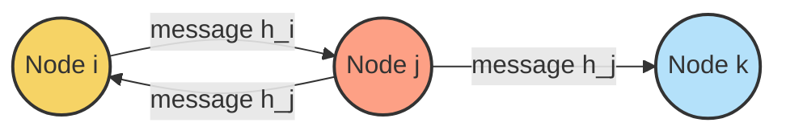
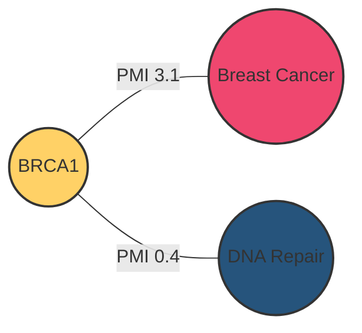
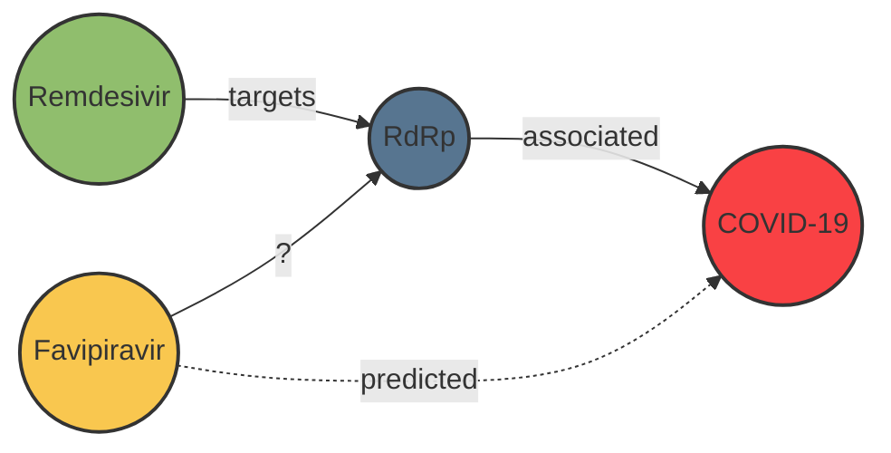

<!-- markdownlint-disable MD033 -->

## Graph Neural Networks in Modern Medicine

Master's in Medical Informatics · 90 minutes!

---

- You know neurons, activations, loss, and backpropagation
- Today adds relational inductive bias on top of familiar NN ideas
- Expect light math, heavy intuition, and clinical relevance

---

## Learning Objectives

- Motivate why graphs appear naturally in biomedical data
- Explain message passing, aggregation, and attention in GNNs
- Practice a manual forward pass on a toy graph
- Outline how to build graphs from unstructured medical text
- Analyze three high-impact medical GNN applications
- Sketch future directions relevant to clinical AI

---

## Agenda & Timing

- 10 min · Why graphs in medicine?
- 30 min · Core GNN mechanics
- 15 min · Interactive calculation
- 10 min · Building graphs from text
- 15 min · Medical use cases
- 10 min · Wrap-up and Q&A

---

## Why Graphs in Medicine?

### Why graphs fit biomedical data

- Relational structure captures comorbidities, molecular interactions, and care pathways.
- GNNs propagate neighborhood context for predictions grounded in patient cohorts.
- Upcoming: core graph tasks, data sources, and real-world deployments in medicine.

---

## From Tables to Relationships

- Clinical data often violates the IID assumption
- Entities (patients, genes, drugs) interact in complex ways
- Graphs encode structure that tabular models discard

<!-- notes -->
Relational modeling captures shared signal beyond isolated samples.

---

## Biomedical Graph Examples

- Biological networks: protein-protein, gene regulatory
- Molecular graphs: atoms as nodes, bonds as edges
- Patient similarity networks: edges from shared diagnoses or demographics
- Knowledge graphs: literature-derived links among diseases, symptoms, drugs
- Data sources: STRING, DrugBank, MIMIC-III, PubMed Central full-text corpora
- Structured + unstructured signals fuse into a single relational view of care

---

## What Do GNNs Predict?

- Node classification: e.g., is a protein implicated in Alzheimer's?
- Link prediction: e.g., will a new drug interact with a target?
- Graph classification: e.g., is a molecule toxic?
- Evaluation typically uses AUROC/AP for node/link tasks and accuracy/F1 for graph tasks
- Interpretability tools (Grad-CAM, attention heatmaps) help clinicians audit outputs

---

## Example · Patient Similarity Graph

- Nodes = 5k oncology patients, features = diagnoses, labs, genomics panels
- Edges connect patients with cosine similarity > 0.8 in feature space
- Predict: 12-month survival (node classification)
- Insights: communities align with staging + comorbid burden, guiding trial stratification

## Core GNN Concepts · Overview

- Start from adjacency `A` and feature matrix `X`
- Message passing layers extend MLPs to relational data
- We will combine intuition, math, and a manual aggregation demo

---

## Representing a Graph

- Adjacency matrix `A`: `A[i, j] = 1` if nodes `i` and `j` connect
- Node feature matrix `X`: each row holds a node's attributes
- Optional edge features for weighted or directed graphs

---

## Example Adjacency Matrix

|     | A | B | C | D |
|-----|---|---|---|---|
| **A** | 1 | 1 | 1 | 0 |
| **B** | 1 | 1 | 1 | 0 |
| **C** | 1 | 1 | 1 | 1 |
| **D** | 0 | 0 | 1 | 1 |

- Added self-loops (diagonal) to keep a node's own information

---

## Message Passing Intuition

- "You are the average of your closest colleagues" – every node diffuses its signal.
- Neighbors aggregate incoming messages before transforming them.
- Stacking rounds lets information flow farther across the graph.

:::tip{title="Key takeaway"}
Message passing injects relational inductive bias: nodes continually refine themselves using neighborhood evidence instead of treating samples as IID.
:::

---

## Mathematical View

| Symbol | Meaning | GNN role |
|--------|---------|----------|
| $H^{(l)}$ | Node embeddings at layer `l` | Carries evolving representation |
| $\tilde{A}$ | Normalized adjacency ($D^{-1/2}(A + I)D^{-1/2}$) | Aggregates neighbor signals stably |
| $W^{(l)}$ | Learnable weight matrix | Transforms aggregated features |
| $\sigma$ | Activation (ReLU, GELU) | Injects non-linearity |

Final update: $H^{(l+1)} = \sigma(\tilde{A} H^{(l)} W^{(l)})$

:::info{title="Practical note"}
Normalize $A$ to prevent exploding node degrees, add self-loops to retain a node's own state, and share $W^{(l)}$ across all nodes for permutation invariance.
:::

---

## Stacking Layers

| Depth | Neighborhood | Risk | Mitigation |
|-------|--------------|------|------------|
| 1 layer | Immediate neighbors | Local only | Increase depth |
| 2-3 layers | 2-3 hops | Moderate smoothing | Residual links, layer norm |
| 4+ layers | Many hops | **Over-smoothing / over-squashing** | Jump knowledge, attention, adaptive depth |

:::warning{title="Watch out"}
Over-squashing appears when narrow bottlenecks force many paths through a single node. Consider adaptive sampling or rewiring edges to relieve pressure.
:::

---

## Beyond Averaging: Attention

- Not all neighbors are equally informative
- Graph Attention Networks learn edge weights during aggregation
- Dynamic focus improves robustness to noisy or dense graphs
- Supports heterogeneous neighborhoods (e.g., patient-to-drug vs patient-to-lab edges)
- Attention weights yield clinician-friendly explanations of influential relations

---

## Interactive Exercise · Setup

- Manual message passing walkthrough on a 4-node graph
- Practice translating topology + features into matrix form
- Build intuition for aggregation before adding weights/activations

---

## Setup

- Undirected graph with nodes A, B, C, D
- Edges: A-B, A-C, B-C, C-D
- Node features (2D):
  - A: [1, 2]
  - B: [3, 4]
  - C: [5, 6]
  - D: [7, 8]
- Goal: manual aggregation for node A (no weights, no activation)
- Analogy: each feature dimension could be lab value z-scores or gene expression levels
- We will treat the graph as having self-loops to keep each node's own signal

---

## Step 1 · Adjacency Matrix

|     | A | B | C | D |
|-----|---|---|---|---|
| **A** | 1 | 1 | 1 | 0 |
| **B** | 1 | 1 | 1 | 0 |
| **C** | 1 | 1 | 1 | 1 |
| **D** | 0 | 0 | 1 | 1 |

- Check: symmetric for undirected graphs, diagonal indicates self-loop

---

## Step 2 · Aggregate Node A

- Gather neighbors: A, B, C
- Sum: `[1, 2] + [3, 4] + [5, 6] = [9, 12]`
- Average: `[9, 12] / 3 = [3, 4]`
- Interpretation: Node A becomes more like its neighborhood community
- Optional variations: degree-weighted mean, include edge weights, or add learnable `W`

---

## Debrief Questions

- How would weights `W` and non-linearities change the result?
- What if we exclude self-loops? include edge weights?
- How does degree imbalance influence aggregation?
- Could we sample neighbors (GraphSAGE) to scale to graphs with millions of nodes?

---

## Building Graphs from Text · Overview

- Biomedical knowledge hides relationships in narratives and reports
- Need reproducible pipelines to extract nodes, edges, and features from text
- We'll cover co-occurrence graphs, PMI weighting, and TF-IDF initialization

---

## When Graphs Are Hidden

- Biomedical knowledge is mostly unstructured text
- Need a pipeline to extract entities and relations
- Resulting graph feeds into downstream GNN tasks

---

## Graph Construction Workflow

1. **Entity extraction** – biomedical NER (e.g., SciSpaCy) tags diseases, genes, drugs
2. **Canonicalization** – map synonyms to ontologies (UMLS, HGNC) to merge duplicates
3. **Edge scoring** – PMI, cosine similarity, or co-treatment statistics
4. **Feature initialization** – TF-IDF, embeddings, or lab value summaries
5. **Quality checks** – sparsity, degree distribution, clinician sanity review

---

## Method 1 · Co-occurrence & PMI

- Nodes: diseases, genes, treatments, symptoms
- Edge if entities co-occur in same sentence or document
- Weight with pointwise mutual information: $\text{PMI}(i, j) = \log \frac{p(i, j)}{p(i) p(j)}$
- Filter by minimum support to reduce noise

---

## Method 2 · TF-IDF Node Features

- Represent documents or concepts with TF-IDF vectors
- Highlights discriminative terms, down-weights ubiquitous words
- Serves as initial node embeddings before message passing

---

## PMI Mini Example

- Sentence: "BRCA1 mutation increases breast cancer risk"
- Co-occurrence counts:
  - `count(BRCA1, breast cancer) = 42`
  - `count(BRCA1) = 210`, `count(breast cancer) = 520`
- $\text{PMI} = \log\frac{42 \cdot N}{210 \times 520}$ → strong link even if entities are common

---

## TF-IDF Walkthrough

- Term Frequency: $tf_{term,doc} = \frac{\text{count in doc}}{\text{total terms in doc}}$
- Inverse Document Frequency: $idf_{term} = \log \frac{N_{docs}}{1 + \text{docs containing term}}$
- Example (3 abstracts):

| Term | Doc A (oncology) | Doc B (cardiology) | Doc C (oncology) | IDF |
|------|------------------|--------------------|------------------|-----|
| chemotherapy | $2/120$ | $0/110$ | $1/95$ | $\log\frac{3}{1+2} = 0.18$ |
| arrhythmia | $0/120$ | $3/110$ | $0/95$ | $\log\frac{3}{1+1} = 0.41$ |
| biomarkers | $1/120$ | $1/110$ | $2/95$ | $\log\frac{3}{1+3} = -0.12$ |

- Multiply `tf × idf` → high scores highlight discipline-specific vocabulary for node features

---

## Medical Use Cases · Snapshot

- Translational impact across drug discovery, patient management, and pathology
- Common thread: graphs encode multi-entity interactions missed by flat models
- We'll deep dive into repurposing, risk prediction, and histopathology scene graphs

---

## Use Case · Drug Repurposing

- Graph: drugs, proteins, diseases, anatomy concepts
- Task: link prediction for new drug-disease associations
- Impact: prioritizes hypotheses for lab validation (e.g., GDRnet for COVID-19)
- Scale: 41k nodes, 1.3M edges pulled from DrugBank, CTD, and literature mining
- Research spotlight: Scientific Reports (2022) showed top-15 hit rate for approved therapies

---

## Use Case · Patient Outcome Prediction

- Graph: patient nodes with EHR-derived features
- Edges: similarity based on diagnoses, labs, demographics
- Task: node classification for in-hospital mortality risk
- Impact: more accurate alerts than isolated patient models
- Feature fusion: structured codes + temporal vitals encoded as visit sequences
- Reported AUROC +6% over XGBoost baseline on 90k-patient cohort (JMIR Med. Inform. 2023)
- Clinical use: early warning dashboards for deterioration within 48 hours

---

## Use Case · Histopathology Scene Graphs

- Pipeline: detect nuclei or regions, build spatial graph
- Task: graph classification for tissue phenotype
- Impact: captures microenvironment context beyond CNNs
- Nodes carry morphological descriptors; edges encode polygon adjacency
- Outperforms ResNet baseline by +5% accuracy on colorectal cancer patches (TIPTEKNO 2021)
- Enables pathologists to inspect cell communities rather than single regions

---

## Literature Snapshot

| Year | Domain | Dataset | Headline Result |
|------|--------|---------|-----------------|
| 2022 | Drug repurposing | 42k-node biomedical knowledge graph | 78% of known therapies ranked top-15 by GDRnet |
| 2023 | Patient outcomes | EHR similarity graph (90k patients) | AUROC 0.87 vs 0.81 baseline |
| 2021 | Histopathology | 7k colorectal tiles | Accuracy 92% with scene graphs |

## Future Outlook

- Clinical translation demands interpretability, reliability, and integration.
- Research pushes toward dynamic, multi-modal, and explainable graph models.
- We'll close with emerging directions, action items, and discussion prompts.

---

## Emerging Directions

- Explainable GNNs: surface influential nodes and edges
- Dynamic graphs: model disease progression over time
- Multi-modal fusion: integrate omics, imaging, and clinical text
- Deployment hurdles: data sharing, privacy, regulatory validation
- Trustworthy AI: calibrate uncertainty, perform counterfactual testing, and monitor drift post-deployment

---

## Action Items for You

- Read target paper per use case before the lab session
- Identify a dataset in your research that benefits from graph structure
- Sketch a graph-building pipeline tailored to that dataset
- Prototype a PyG or DGL notebook to sanity-check graph construction choices before scaling up

---

## Discussion & Q&A

- What datasets in your projects have latent graph structure?
- Where do you foresee the biggest implementation friction?
- How could we evaluate fairness and bias in medical GNNs?

---

## References

1. N. B. R. K. L. K. et al., "A computational approach to drug repurposing using graph neural networks," Scientific Reports, 2022.
2. "Enhancing Healthcare Analytics: A Novel Approach to Predicting Patient Outcomes Using Graph Neural Networks on Electronic Health Records," JMIR Medical Informatics, 2023.
3. S. Gecer et al., "Graph Neural Networks for Colorectal Histopathological Image Classification," TIPTEKNO, 2021.

---

## Thank You

- Slides: clone repo and run `npx slidev slides.md`
- Contact: [add email or office hours]
