<!-- markdownlint-disable MD033 -->

## Graph Neural Networks in Modern Medicine

**From Molecular Interactions to Patient Outcomes**

Master's in Medical Informatics · 90 minutes

<div class="abs-br m-6 text-sm opacity-50">
  Press <kbd>space</kbd> to advance · <kbd>?</kbd> for controls
</div>

---
layout: center
class: text-center
---

# Before We Begin

<div class="grid grid-cols-3 gap-4 mt-8">
<div>

### ✅ You know
- Neural networks
- Backpropagation
- Loss functions

</div>
<div>

### 🎯 Today you'll learn
- **Why** graphs matter
- **How** GNNs work
- **Where** they're deployed

</div>
<div>

### 💡 Approach
- Light math
- Heavy intuition
- Clinical relevance

</div>
</div>

---

## Learning Objectives

<v-clicks>

🎓 **Motivate** why graphs appear naturally in biomedical data

🔧 **Explain** message passing, aggregation, and attention mechanisms

✍️ **Practice** a manual forward pass on a toy graph

🏗️ **Outline** how to build graphs from unstructured medical text

🏥 **Analyze** three high-impact medical GNN applications

🚀 **Sketch** future directions relevant to clinical AI

</v-clicks>

---
layout: two-cols
---

## Agenda & Timing

### Part 1 (10 min)
🧬 **Why graphs in medicine?**

### Part 2 (30 min)
⚙️ **Core GNN mechanics**

### Part 3 (15 min)
🧮 **Interactive calculation**

::right::

<div class="mt-16">

### Part 4 (10 min)
📝 **Building graphs from text**

### Part 5 (15 min)
🏥 **Medical use cases**

### Part 6 (10 min)
💬 **Wrap-up and Q&A**

</div>

---
layout: section
---

# Part 1

## Why Graphs in Medicine?

<div class="opacity-70 mt-4">
Connect familiar neural network ideas to relational inductive bias<br>
Ground the motivation in concrete biomedical structure before the math
</div>

---

## The Central Question

<div class="text-center text-3xl my-16">
Why can't we just use <span class="text-blue-500">tables</span> and <span class="text-green-500">CNNs</span>?
</div>

<v-clicks>

<div class="text-2xl opacity-70 text-center mt-8">
Because medicine is fundamentally <span class="text-red-500 font-bold">relational</span>
</div>

</v-clicks>

---
layout: two-cols
---

## From Tables to Relationships

### The tabular assumption

- Each patient is **independent**
- Features are **isolated**
- No shared context

### The reality

<v-click>

- Patients **interact** in cohorts
- Diseases **co-occur**
- Treatments **cascade**

</v-click>

::right::

<div class="ml-8 mt-8">


<div class="text-sm opacity-70 mt-4">
Graphs encode the structure<br>that tabular models discard
</div>

</div>

---

## Biomedical Graph Examples

<div class="grid grid-cols-2 gap-8 mt-8">

<div>

### 🧬 Biology & Chemistry

- **Protein-protein** interaction networks
- **Gene regulatory** networks  
- **Molecular graphs**: atoms = nodes, bonds = edges

<div class="text-xs opacity-60 mt-2">
Sources: STRING, ChEMBL, PubChem
</div>

</div>

<div>

### 🏥 Clinical Cohorts

- **Patient similarity** graphs from diagnoses, labs, demographics
- **Care pathways** capturing temporal encounters
- **Treatment cascades** and drug combinations

<div class="text-xs opacity-60 mt-2">
Sources: MIMIC-III, UK Biobank, EHR systems
</div>

</div>

<div>

### 📚 Knowledge Synthesis

- **Literature-derived** knowledge graphs
- **Disease-symptom-drug** relationships
- **Multi-modal fusion**: structured + NLP-extracted relations

<div class="text-xs opacity-60 mt-2">
Sources: PubMed, UMLS, DrugBank
</div>

</div>

<div>

### 🔬 Spatial Biology

- **Tissue microenvironment** graphs
- **Cell-cell interaction** networks
- **Histopathology scene** graphs

<div class="text-xs opacity-60 mt-2">
Sources: Spatial transcriptomics, multiplex imaging
</div>

</div>

</div>

---

## What Do GNNs Predict?

<div class="grid grid-cols-3 gap-6 mt-8">

<div class="border-2 border-blue-400 rounded p-4">

### 🎯 Node Classification

**Question:** Is this entity associated with an outcome?

**Example:** "Is this protein linked to Alzheimer's?"

**Metrics:** AUROC, Average Precision

</div>

<div class="border-2 border-green-400 rounded p-4">

### 🔗 Link Prediction

**Question:** Will these entities interact?

**Example:** "Will this drug bind to this protein?"

**Metrics:** AUROC, Hits@K, MRR

</div>

<div class="border-2 border-purple-400 rounded p-4">

### 📊 Graph Classification

**Question:** What class is this entire structure?

**Example:** "Is this molecule toxic?"

**Metrics:** Accuracy, F1, AUC

</div>

</div>

:::tip{title="Clinical translation"}
Always pair model scores with **interpretability** (attention weights, Grad-CAM) so clinical reviewers can audit high-stakes predictions. Model performance means nothing without trust.
:::

---
layout: fact
---

## Real Example

**Patient Similarity Graph**

<v-clicks>

- 🏥 **5,000** oncology patients  
- 📊 Features: diagnoses, labs, genomics panels
- 🔗 Edges: cosine similarity > 0.8
- 🎯 **Predict:** 12-month survival (node classification)

</v-clicks>

<v-click>

<div class="mt-8 p-4 bg-blue-50 rounded">

**💡 Insight:** Patient communities align with staging + comorbid burden → guides trial stratification

</div>

</v-click>

---
layout: section
---

# Part 2

## Core GNN Mechanics

<div class="opacity-70 mt-4">
Translate graphs into matrices ready for deep learning<br>
Build intuition for message passing before diving into equations
</div>

---

## Core GNN Concepts

<div class="text-center my-12">


</div>

<v-clicks>

- 📐 **Start:** Adjacency `A` and feature matrix `X`
- 🔄 **Process:** Message passing extends MLPs to relational data
- 🎯 **Output:** Rich node embeddings that encode neighborhood context

</v-clicks>

---
layout: two-cols
---

## Representing a Graph

### The Adjacency Matrix `A`

`A[i, j] = 1` if nodes `i` and `j` connect

- **Square** matrix: `N × N`
- **Symmetric** for undirected graphs
- **Diagonal** = self-loops

### The Feature Matrix `X`

Each row = one node's attributes

- **Shape:** `N × F`
- **F** = feature dimension
- Examples: gene expression, lab values

::right::

<div class="ml-8">

<v-click>

### ✅ Sanity Check

```python
# Confirm dimensions work
assert A.shape == (N, N)
assert X.shape == (N, F)

# Matrix multiplication
AX = A @ X  # ✓ (N,N) @ (N,F) = (N,F)
```

</v-click>

<v-click>

:::info{title="Edge features"}
For weighted/directed graphs, store edge attributes in separate tensor or use adjacency list format.
:::

</v-click>

</div>

---

## Example Adjacency Matrix

<div class="grid grid-cols-2 gap-8">

<div>

### The Matrix

|     | A | B | C | D |
|-----|---|---|---|---|
| **A** | 1 | 1 | 1 | 0 |
| **B** | 1 | 1 | 1 | 0 |
| **C** | 1 | 1 | 1 | 1 |
| **D** | 0 | 0 | 1 | 1 |

<div class="text-sm opacity-70 mt-4">
✓ Diagonal = self-loops<br>
✓ Symmetric (undirected)
</div>

</div>

<div>

### The Graph


<div class="text-sm opacity-70 mt-4">
This matrix captures all connections
</div>

</div>

</div>

---
layout: center
class: text-center
---

# The Core Idea

<div class="text-3xl my-12 opacity-80">
"You are the average of your five closest colleagues"
</div>

<v-click>

<div class="text-xl opacity-60">
In GNNs, every node updates itself by aggregating information from its neighbors
</div>

</v-click>

---

## Message Passing: Step by Step

<v-clicks depth="2">

1. **📤 Send Messages**
   - Each node broadcasts its current feature vector to neighbors
   - Think: "Here's what I know about myself"

2. **📥 Aggregate**
   - Each node collects messages from all neighbors
   - Combine via: sum, mean, max, or attention-weighted

3. **🔄 Transform**
   - Apply learnable weights `W` and activation `σ`
   - Update: create new, richer representation

4. **🔁 Repeat**
   - Stack layers → information flows farther
   - 2 layers = 2-hop neighborhood influence

</v-clicks>

---

## Visual: Message Passing


<div class="mt-8">

:::tip{title="Key insight"}
Message passing injects **relational inductive bias**: nodes continually refine themselves using neighborhood evidence instead of treating samples as independent.
:::

</div>

---
layout: two-cols
---

## The Math: GNN Layer Update

### The Formula

$$
H^{(l+1)} = \sigma(\tilde{A} H^{(l)} W^{(l)})
$$

### Breaking it down

<v-clicks>

- $H^{(l)}$ = node embeddings at layer $l$
- $\tilde{A}$ = normalized adjacency
- $W^{(l)}$ = learnable weights
- $\sigma$ = activation (ReLU, GELU)

</v-clicks>

::right::

<div class="ml-8">

<v-click>

### Why normalize $\tilde{A}$?

$$
\tilde{A} = D^{-1/2}(A + I)D^{-1/2}
$$

</v-click>

<v-clicks>

- Prevents **degree explosion**
- High-degree nodes don't dominate
- Keeps gradients stable

</v-clicks>

<v-click>

### Parameter sharing

Same $W^{(l)}$ for all nodes → **permutation invariance**

</v-click>

</div>

---

## How Deep Should You Go?

<div class="grid grid-cols-3 gap-4 mt-8">

<div class="border-2 border-blue-400 rounded p-4">

### 1 Layer

**Neighborhood:** Direct neighbors only

**Risk:** Too local

**Use when:** Dense graphs, simple patterns

</div>

<div class="border-2 border-green-400 rounded p-4">

### 2-3 Layers

**Neighborhood:** 2-3 hops

**Risk:** Moderate smoothing

**Sweet spot:** Most applications

**Mitigation:** Residual connections, layer norm

</div>

<div class="border-2 border-red-400 rounded p-4">

### 4+ Layers

**Neighborhood:** Many hops

**Risk:** ⚠️ **Over-smoothing** / **Over-squashing**

**Solutions:** Jump knowledge, attention, adaptive depth

</div>

</div>

:::warning{title="Over-squashing alert"}
Narrow bottlenecks force many paths through single nodes. Consider **adaptive sampling** (GraphSAGE) or **edge rewiring** to relieve pressure.
:::

---

## Beyond Averaging: Attention

<div class="grid grid-cols-2 gap-8">

<div>

### The Problem

Not all neighbors are equally informative

- Some edges carry **stronger signals**
- Dense graphs have **noisy connections**
- Heterogeneous data needs **adaptive weighting**

</div>

<div>

### The Solution: Graph Attention Networks (GAT)

<v-clicks>

1. **Learn edge weights** during aggregation
2. **Attention mechanism** scores neighbor importance
3. **Dynamic focus** improves robustness
4. **Explainable**: attention weights show influential relations

</v-clicks>

</div>

</div>

<v-click>

<div class="mt-8 p-4 bg-purple-50 rounded">

**🏥 Clinical Example:** In a patient similarity graph, attention can automatically upweight neighbors with matching comorbidities while downweighting weak demographic similarities.

</div>

</v-click>

---
layout: section
---

# Part 3

## Interactive Practice

<div class="opacity-70 mt-4">
Slow down for a pencil-and-paper message passing walkthrough<br>
Surface common implementation gotchas before touching code
</div>

---
layout: center
class: text-center
---

# 🧮 Let's Calculate Together!

<div class="text-2xl my-8 opacity-70">
Manual message passing on a 4-node graph
</div>

<v-click>

<div class="text-lg opacity-60">
Build intuition before we abstract to tensors
</div>

</v-click>

---
layout: two-cols
---

## The Setup

### Our Graph

<v-clicks>

- **4 nodes:** A, B, C, D
- **Edges:** A-B, A-C, B-C, C-D
- **Self-loops:** Yes (keep own signal)

</v-clicks>

### Node Features (2D vectors)

<v-clicks>

- **A:** `[1, 2]`
- **B:** `[3, 4]`
- **C:** `[5, 6]`
- **D:** `[7, 8]`

</v-clicks>

::right::

<div class="ml-8">

<v-click>

### 🎯 Goal

Calculate updated features for **Node A** using simple averaging (no weights, no activation)

</v-click>

<v-click>

### 🏥 Medical Analogy

Think of each dimension as:
- **Dim 1:** HbA1c z-score
- **Dim 2:** eGFR z-score

Node A "learns" from similar patients

</v-click>

<v-click>

:::tip{title="Pro tip"}
Label adjacency matrix rows/columns clearly to avoid neighbor mix-ups!
:::

</v-click>

</div>

---

## Step 1: Build the Adjacency Matrix

<div class="grid grid-cols-2 gap-8">

<div>

### The Matrix `A`

|     | A | B | C | D |
|-----|---|---|---|---|
| **A** | 1 | 1 | 1 | 0 |
| **B** | 1 | 1 | 1 | 0 |
| **C** | 1 | 1 | 1 | 1 |
| **D** | 0 | 0 | 1 | 1 |

<v-clicks>

- ✓ **Symmetric** (undirected)
- ✓ **Diagonal = 1** (self-loops)
- ✓ **Node A connects to:** A, B, C

</v-clicks>

</div>

<div>

### The Topology


<v-click>

**Visualize first,** calculate second!

</v-click>

</div>

</div>

---
layout: center
---

## Step 2: Aggregate Node A

<v-clicks depth="2">

1. **Identify neighbors of A:**
   - A itself (self-loop)
   - B (connected)
   - C (connected)

2. **Gather their features:**
   - A: `[1, 2]`
   - B: `[3, 4]`
   - C: `[5, 6]`

3. **Sum:**
   - `[1, 2] + [3, 4] + [5, 6] = [9, 12]`

4. **Average (divide by 3):**
   - `[9, 12] / 3 = [3, 4]`

</v-clicks>

<v-click>

<div class="mt-8 p-4 bg-green-50 rounded text-center">

**🎉 Node A's new embedding: `[3, 4]`**

Node A has moved toward its neighborhood community!

</div>

</v-click>

---

## Debrief: What Did We Learn?

<v-clicks depth="2">

### 🤔 Discussion Questions

1. **What if we added weights `W` and activation `σ`?**
   - Each neighbor's contribution gets transformed
   - Enables learning complex patterns
   - Deeper stacks capture higher-order features

2. **What if we dropped self-loops?**
   - Node loses its own signal
   - Often hurts stability
   - Can cause over-smoothing faster

3. **How does degree imbalance affect this?**
   - High-degree nodes (hubs) can dominate
   - Low-degree nodes get washed out
   - **Solution:** Normalization (`D^-1/2 A D^-1/2`), attention, or degree-aware weights

4. **Could we scale to millions of nodes?**
   - **GraphSAGE:** Sample k neighbors instead of using all
   - Keeps compute tractable
   - Still approximates full neighborhood

</v-clicks>

---
layout: section
---

# Part 4

## Building Graphs from Text

<div class="opacity-70 mt-4">
Extract structure from unstructured clinical narratives and literature<br>
Surface the NLP tooling needed before a GNN ever trains
</div>

---
layout: center
class: text-center
---

# The Challenge

<div class="text-2xl my-12 opacity-80">
Most biomedical knowledge is trapped in <span class="text-blue-500">unstructured text</span>
</div>

<v-click>

<div class="text-xl opacity-60">
Clinical notes · Research papers · Pathology reports
</div>

</v-click>

<v-click>

<div class="text-3xl mt-12">
📝 → 🕸️ → 🤖
</div>

<div class="text-lg opacity-60 mt-4">
Text → Graph → GNN
</div>

</v-click>

---

## Graph Construction Pipeline

```mermaid
graph LR
  A[📄 Raw Text] --> B[🏷️ Entity Extraction]
  B --> C[🔗 Canonicalization]
  C --> D[⚖️ Edge Scoring]
  D --> E[🎨 Feature Init]
  E --> F[✅ Quality Check]
  F --> G[🕸️ Final Graph]
  
  style A fill:#e3f2fd
  style B fill:#f3e5f5
  style C fill:#fff3e0
  style D fill:#e8f5e9
  style E fill:#fce4ec
  style F fill:#f1f8e9
  style G fill:#e0f2f1
```

<div class="mt-8">



</div>

<v-clicks>

1. **🏷️ Entity extraction** – NER tags diseases, genes, drugs (SciSpaCy, PubMedBERT)
2. **🔗 Canonicalization** – Map synonyms to ontologies (UMLS, HGNC) → merge duplicates
3. **⚖️ Edge scoring** – PMI, cosine similarity, co-treatment statistics
4. **🎨 Feature initialization** – TF-IDF, embeddings, or lab value summaries
5. **✅ Quality checks** – Sparsity, degree distribution, clinician sanity review

</v-clicks>

---
layout: two-cols
---

## Method 1: Co-occurrence & PMI

### The Idea

- **Nodes:** Diseases, genes, drugs, symptoms
- **Edges:** Created when entities co-occur in text
- **Weight:** Pointwise Mutual Information (PMI)

### PMI Formula

$$
\text{PMI}(i, j) = \log \frac{p(i, j)}{p(i) \cdot p(j)}
$$

<v-click>

**Intuition:** How much more likely are these entities to co-occur than by random chance?

</v-click>

::right::

<div class="ml-8">

<v-click>

### Example

**Sentence:** "BRCA1 mutation increases breast cancer risk"

**Co-occurrence counts:**
- `count(BRCA1, breast cancer) = 42`
- `count(BRCA1) = 210`
- `count(breast cancer) = 520`
- `Total docs N = 10,000`

**PMI calculation:**

$$
\text{PMI} = \log\frac{42 \cdot 10000}{210 \times 520} \approx 3.1
$$

**High PMI** → strong semantic link!

</v-click>

</div>

---

## PMI Visualization


<div class="mt-8">

<v-clicks>

- **Thick edges** (high PMI) = strong associations
- **Thin edges** (low PMI) = weak/spurious co-occurrence
- Filter edges below threshold to reduce noise

</v-clicks>

</div>

---

## Method 2: TF-IDF for Node Features

<div class="grid grid-cols-2 gap-8">

<div>

### The Formulas

**Term Frequency:**
$$
tf_{term,doc} = \frac{\text{count in doc}}{\text{total terms in doc}}
$$

**Inverse Document Frequency:**
$$
idf_{term} = \log \frac{N_{docs}}{1 + \text{docs containing term}}
$$

**Final Score:**
$$
\text{TF-IDF} = tf \times idf
$$

</div>

<div>

### What It Does

<v-clicks>

- **Highlights** discriminative terms
- **Down-weights** ubiquitous words
- **Creates** initial node embeddings
- **Serves** as input to message passing

</v-clicks>

</div>

</div>

---

## TF-IDF Example

<div class="text-sm">

**Scenario:** 3 medical abstracts

| Term | Doc A (oncology) | Doc B (cardiology) | Doc C (oncology) | IDF |
|------|------------------|--------------------|------------------|-----|
| chemotherapy | $2/120$ | $0/110$ | $1/95$ | $\log\frac{3}{1+2} = 0.18$ |
| arrhythmia | $0/120$ | $3/110$ | $0/95$ | $\log\frac{3}{1+1} = 0.41$ |
| biomarkers | $1/120$ | $1/110$ | $2/95$ | $\log\frac{3}{1+3} = -0.12$ |

</div>

<v-clicks>

- **chemotherapy:** High TF in oncology docs → domain-specific
- **arrhythmia:** Only in cardiology doc → highly discriminative (high IDF)
- **biomarkers:** Everywhere → low discriminative power (low/negative IDF)

**Result:** TF × IDF vectors encode **domain-specific vocabulary** for each node

</v-clicks>

---
layout: section
---

# Part 5

## Medical Use Cases

<div class="opacity-70 mt-4">
Connect abstract mechanics to translational wins clinicians care about<br>
Highlight evaluation patterns students can investigate post-lecture
</div>

---
layout: center
class: text-center
---

# Real-World Impact

<div class="grid grid-cols-3 gap-8 mt-12">

<div class="p-4 border-2 border-blue-400 rounded">

### 💊 Drug Discovery

Link prediction for repurposing

</div>

<div class="p-4 border-2 border-green-400 rounded">

### 🏥 Patient Risk

Node classification for outcomes

</div>

<div class="p-4 border-2 border-purple-400 rounded">

### 🔬 Pathology

Graph classification for tissue

</div>

</div>

<v-click>

<div class="text-lg opacity-70 mt-12">
Common thread: Graphs encode **multi-entity interactions** missed by flat models
</div>

</v-click>

---

## Use Case 1: Drug Repurposing

<div class="grid grid-cols-2 gap-8">

<div>

### The Problem

- Drug discovery is **slow** and **expensive**
- Existing drugs may have **hidden uses**
- Need: prioritize hypotheses for validation

### The GNN Solution

<v-clicks>

- **Graph:** Drugs, proteins, diseases (42k nodes, 1.3M edges)
- **Sources:** DrugBank, CTD, literature mining
- **Task:** Link prediction for drug-disease pairs
- **Model:** GDRnet (heterogeneous GNN)

</v-clicks>

</div>

<div>


<v-click>

**Impact:** 78% of approved therapies ranked **top-15** by the model *(Scientific Reports, 2022)*

</v-click>

</div>

</div>

---

## Use Case 2: Patient Outcome Prediction

<div class="grid grid-cols-2 gap-8">

<div>

### The Challenge

How to predict mortality using **complex, multi-modal** patient data?

### The Approach

<v-clicks>

- **Graph:** Patient similarity network
- **Nodes:** 90k patients from EHR
- **Features:** Diagnoses, procedures, labs, demographics
- **Edges:** Similarity > threshold
- **Task:** Node classification (mortality risk)

</v-clicks>

</div>

<div>

<v-click>

### The Architecture


</v-click>

<v-click>

### The Results

**AUROC 0.87** vs **0.81** (XGBoost baseline)

+6% improvement by leveraging **patient cohort structure**

*JMIR Medical Informatics, 2023*

</v-click>

</div>

</div>

<v-click>

<div class="mt-6 p-4 bg-blue-50 rounded">

**💡 Clinical Use:** Early warning dashboards for deterioration within 48 hours

</div>

</v-click>

---

## Use Case 3: Histopathology Scene Graphs

<div class="grid grid-cols-2 gap-8">

<div>

### Beyond CNNs

Standard CNNs see **pixels**, not **spatial structure**

### The GNN Approach

<v-clicks>

1. **Detect** nuclei/regions with object detector
2. **Build** spatial graph (proximity edges)
3. **Classify** entire graph → tissue phenotype

</v-clicks>

<v-click>

### Dataset

- 7k colorectal cancer histology tiles
- Nodes = superpixels with morphological features
- Edges = spatial adjacency

</v-click>

</div>

<div>

<v-click>

### Scene Graph Structure


</v-click>

<v-click>

### Performance

**92% accuracy** with GNN<br>
**87% accuracy** with ResNet baseline

+5% by capturing **tissue microenvironment**

*TIPTEKNO, 2021*

</v-click>

</div>

</div>

---

## Literature Snapshot

<div class="overflow-auto text-sm">

| Year | Domain | Scale | Task | Headline Result | Citation |
|------|--------|-------|------|-----------------|----------|
| 2022 | 💊 Drug repurposing | 42k nodes, 1.3M edges | Link prediction | 78% of therapies in top-15 | *Sci. Rep.* |
| 2023 | 🏥 Patient outcomes | 90k patients | Node classification | AUROC 0.87 vs 0.81 baseline | *JMIR Med. Inform.* |
| 2021 | 🔬 Histopathology | 7k tissue tiles | Graph classification | 92% accuracy (+5% vs CNN) | *TIPTEKNO* |

</div>

<v-click>

<div class="mt-8 grid grid-cols-3 gap-4">

<div class="p-4 bg-blue-50 rounded">

**Common Pattern**

Graphs outperform flat models by **4-6%**

</div>

<div class="p-4 bg-green-50 rounded">

**Why It Matters**

In clinical AI, 5% AUROC can mean **thousands of lives**

</div>

<div class="p-4 bg-purple-50 rounded">

**The Catch**

Need interpretability + validation for deployment

</div>

</div>

</v-click>

---
layout: section
---

# Part 6

## Future Directions

<div class="opacity-70 mt-4">
Step back from case studies to map upcoming research frontiers<br>
Frame actionable next steps for students' own projects
</div>

---

## The Road Ahead: Emerging Directions

<div class="grid grid-cols-2 gap-8 mt-8">

<div>

### 🔍 Explainable GNNs

<v-clicks>

- Surface **influential nodes** and edges
- **Attention visualization** for auditing
- **Counterfactual explanations**: "Why this prediction?"
- Critical for **clinical trust**

</v-clicks>

</div>

<div>

### ⏱️ Dynamic Graphs

<v-clicks>

- Model **disease progression** over time
- **Temporal edges** capture evolving relationships
- **Recurrent GNNs** for longitudinal EHR
- Predict **trajectory**, not just outcome

</v-clicks>

</div>

<div>

### 🧬 Multi-Modal Fusion

<v-clicks>

- Integrate **omics**, **imaging**, **clinical text**
- Heterogeneous graphs with **different node types**
- **Cross-modal attention** for alignment
- Holistic patient representation

</v-clicks>

</div>

<div>

### 🏥 Deployment Challenges

<v-clicks>

- **Data sharing** across institutions
- **Privacy**: federated learning on graphs
- **Regulatory validation** (FDA, CE marking)
- **Bias auditing** across demographics

</v-clicks>

</div>

</div>

---

## Trustworthy AI: Beyond Accuracy

<v-clicks depth="2">

### The Challenge

High AUROC ≠ Clinical readiness

### What's Missing?

1. **Calibration**
   - Are predicted probabilities reliable?
   - Temperature scaling, Platt scaling

2. **Uncertainty Quantification**
   - Bayesian GNNs, Monte Carlo dropout
   - Flag low-confidence predictions

3. **Counterfactual Testing**
   - "What if this edge didn't exist?"
   - Causal reasoning on graphs

4. **Drift Monitoring**
   - Distribution shift post-deployment
   - Continuous validation pipelines

</v-clicks>

<v-click>

<div class="mt-6 p-4 bg-yellow-50 rounded">

⚠️ **Remember:** A model performing well on historical data may fail catastrophically on new populations or hospitals without these safeguards.

</div>

</v-click>

---
layout: center
class: text-center
---

# Key Takeaways

<v-clicks>

<div class="text-2xl my-4">
🕸️ **Graph structure** appears everywhere in biomedicine → model it explicitly
</div>

<div class="text-2xl my-4">
🔄 **Message passing** = neighborhood-aware MLPs → watch normalization
</div>

<div class="text-2xl my-4">
🏗️ **Graph construction** matters as much as the architecture
</div>

<div class="text-2xl my-4">
🏥 **Clinical translation** requires interpretability + validation, not just AUROC
</div>

</v-clicks>

---

## Your Action Items

<div class="grid grid-cols-2 gap-8 mt-8">

<div>

### 📚 Before Lab Session

<v-clicks>

1. Read **one paper** per use case (provided in references)
2. Identify a **graph structure** in your current research
3. Sketch entities, edges, and features on paper

</v-clicks>

</div>

<div>

### 💻 Hands-On Preparation

<v-clicks>

1. Install **PyTorch Geometric** or **DGL**
2. Complete tutorial: build simple GCN
3. Download a **small benchmark** (Cora, PubMed)

</v-clicks>

</div>

</div>

<v-click>

<div class="mt-8 p-4 bg-gradient-to-r from-blue-50 to-purple-50 rounded">

### 🎯 Challenge Question

**Can you think of a dataset in your research that has latent graph structure?**

- Patient cohorts with shared diagnoses?
- Proteins with interaction networks?
- Clinical pathways across hospitals?

Bring your idea to the lab session!

</div>

</v-click>

---
layout: center
class: text-center
---

# Discussion & Q&A

<div class="grid grid-cols-3 gap-8 mt-12 text-left">

<div class="p-4 border-2 border-blue-400 rounded">

### 💭 Question 1

What datasets in your projects have latent graph structure?

</div>

<div class="p-4 border-2 border-green-400 rounded">

### ⚙️ Question 2

Where do you foresee the biggest implementation friction?

</div>

<div class="p-4 border-2 border-purple-400 rounded">

### ⚖️ Question 3

How could we evaluate fairness and bias in medical GNNs?

</div>

</div>

<v-click>

<div class="mt-12 text-xl opacity-70">
Let's open the floor! 🎤
</div>

</v-click>

---

## References

<div class="text-sm grid grid-cols-2 gap-6">

<div>

### Use Case 1: Drug Repurposing

**Paper:** "A computational approach to drug repurposing using graph neural networks"

**Authors:** N. B. R. K. L. K. et al.

**Journal:** *Scientific Reports*, 2022

**Key Finding:** GDRnet ranked 78% of approved therapies in top-15 predictions using a 42k-node heterogeneous biomedical knowledge graph.

</div>

<div>

### Use Case 2: Patient Outcomes

**Paper:** "Enhancing Healthcare Analytics: A Novel Approach to Predicting Patient Outcomes Using Graph Neural Networks on Electronic Health Records"

**Journal:** *JMIR Medical Informatics*, 2023

**Key Finding:** Patient similarity GNN achieved AUROC 0.87 vs 0.81 for XGBoost on 90k-patient mortality prediction.

</div>

<div>

### Use Case 3: Histopathology

**Paper:** "Graph Neural Networks for Colorectal Histopathological Image Classification"

**Authors:** S. Gecer et al.

**Conference:** *TIPTEKNO*, 2021

**Key Finding:** Scene graph GNN achieved 92% accuracy (+5% over ResNet) on colorectal tissue classification by capturing spatial relationships.

</div>

<div>

### Additional Resources

- **PyTorch Geometric:** [pytorch-geometric.readthedocs.io](https://pytorch-geometric.readthedocs.io)
- **DGL:** [dgl.ai](https://dgl.ai)
- **Graph ML papers:** [paperswithcode.com/task/graph-learning](https://paperswithcode.com/task/graph-learning)
- **Medical datasets:** MIMIC-III, UK Biobank, DrugBank

</div>

</div>

---
layout: end
class: text-center
---

# Thank You!

<div class="mt-12">

## 🎓 Keep Exploring

<div class="grid grid-cols-3 gap-8 mt-8">

<div>

### 📊 Slides

Clone repo and run:

```bash
npx slidev slides.md
```

</div>

<div>

### 📧 Contact

[Add your email]

Office hours: [Add times]

</div>

<div>

### 💬 Questions?

Catch me after class or via email

Happy to discuss your project ideas!

</div>

</div>

</div>

<div class="abs-br m-6 text-sm opacity-50">
  Graph Neural Networks in Modern Medicine · 2025
</div>
