<!-- markdownlint-disable MD033 -->

## Graph Neural Networks in Modern Medicine

**From Molecular Interactions to Patient Outcomes**

Master's in Medical Informatics · 90 minutes

<div class="abs-br m-6 text-sm opacity-50">
  Press <kbd>space</kbd> to advance · <kbd>?</kbd> for controls
</div>

---
layout: center
class: text-center
---

# Before We Begin

<div class="grid grid-cols-3 gap-4 mt-8">
<div>

### You know

- Neural networks
- Backpropagation
- Loss functions

</div>
<div>

### Today you'll learn

- **Why** graphs matter
- **How** GNNs work
- **Where** they're deployed

</div>
<div>

### Approach

- Light math
- Heavy intuition
- Clinical relevance

</div>
</div>

<!--
SPEAKER NOTES:
- Gauge the room: "How many of you have implemented a neural network from scratch?" 
- Reassure them: "If you understand how gradient descent updates weights in an MLP, you already have 80% of what you need for GNNs"
- The key difference: regular NNs assume samples are independent; GNNs explicitly model relationships between samples
- Today's goal: extend your existing NN intuition to relational/graph-structured data
-->

---

## Learning Objectives

<v-clicks>

**Motivate** why graphs appear naturally in biomedical data

**Explain** message passing, aggregation, and attention mechanisms

**Practice** a manual forward pass on a toy graph

**Outline** how to build graphs from unstructured medical text

**Analyze** three high-impact medical GNN applications

**Sketch** future directions relevant to clinical AI

</v-clicks>

---

## Agenda & Timing

<div class="grid grid-cols-2 gap-8 mt-8">

<div>

### Part 1 <span class="text-blue-600">(10 min)</span>
**Why graphs in medicine?**

### Part 2 <span class="text-blue-600">(30 min)</span>
**Core GNN mechanics**

### Part 3 <span class="text-blue-600">(15 min)</span>
**Interactive calculation**

</div>

<div>

### Part 4 <span class="text-blue-600">(10 min)</span>
**Building graphs from text**

### Part 5 <span class="text-blue-600">(15 min)</span>
**Medical use cases**

### Part 6 <span class="text-blue-600">(10 min)</span>
**Wrap-up and Q&A**

</div>

</div>

---
layout: section
---

# Part 1

## Why Graphs in Medicine?

<div class="opacity-70 mt-4">
Connect familiar neural network ideas to relational inductive bias<br>
Ground the motivation in concrete biomedical structure before the math
</div>

<!--
SPEAKER NOTES:
**Relational Inductive Bias:** GNNs inject the assumption that relationships between entities matter for predictions. Unlike traditional ML models that assume samples are independent (IID - Independent and Identically Distributed), GNNs explicitly encode that "you are the average of your five closest colleagues" - your prediction depends on your neighbors.

**Contrast with Non-Biased Assumption (IID):** Classical ML (logistic regression, random forests, CNNs) treats each sample as isolated, assuming no dependencies between data points. This works for independent observations but fails when entities interact, as they do in medicine.

- IID assumption (Independent and Identically Distributed) is a key assumption in classical ML
- In reality: patients in the same hospital share exposures, treatment protocols, even physicians' biases
- Example: If 5 diabetes patients all see the same endocrinologist, their treatment outcomes are not independent
- Tabular models (logistic regression, random forests, even standard neural nets) treat each row as isolated
- Graphs let us explicitly model these dependencies: "This patient is similar to these other 3 patients"
- The graph structure becomes an additional source of information for predictions
-->

---

## The Central Question

<div class="text-center text-3xl my-16">
Why can't we just use <span class="text-blue-500">tables</span> and <span class="text-green-500">CNNs</span>?
</div>

<v-clicks>

<div class="text-2xl opacity-70 text-center mt-8">
Because medicine is fundamentally <span class="text-red-500 font-bold">relational</span>
</div>

</v-clicks>

---

## From Tables to Relationships

<div class="grid grid-cols-2 gap-8 mt-8">

<div>

### Tabular Assumption

<div class="text-sm opacity-70 mb-4">
Each patient independent, features isolated, no shared context
</div>


<div class="text-xs opacity-60 mt-2">
Rows treated as isolated data points
</div>

</div>

<div>

### Reality

<div class="text-sm opacity-70 mb-4">
Patients interact in cohorts, diseases co-occur, treatments cascade
</div>


<div class="text-xs opacity-60 mt-2">
Graphs encode structure that tabular models discard
</div>

</div>

</div>

---

## Biomedical Graph Examples

<div class="grid grid-cols-2 gap-8 mt-8 biomedical-grid">

<div>

### Biology & Chemistry

- **Protein-protein** interaction networks
- **Gene regulatory** networks
- **Molecular graphs**: atoms = nodes, bonds = edges

<div class="text-xs opacity-60 mt-2">
Sources: STRING, ChEMBL, PubChem
</div>

</div>

<div>

### Clinical Cohorts

- **Patient similarity** graphs from diagnoses
- **Care pathways** capturing temporal encounters
- **Treatment cascades** and drug combinations

<div class="text-xs opacity-60 mt-2">
Sources: MIMIC-III, UK Biobank, EHR systems
</div>

</div>

<div>

### Knowledge Synthesis

- **Literature-derived** knowledge graphs
- **Disease-symptom-drug** relationships
- **Multi-modal fusion**: structured + NLP-extracted relations

<div class="text-xs opacity-60 mt-2">
Sources: PubMed, UMLS, DrugBank
</div>

</div>

<div>

### Spatial Biology

- **Tissue microenvironment** graphs
- **Cell-cell interaction** networks
- **Histopathology scene** graphs

<div class="text-xs opacity-60 mt-2">
Sources: Spatial transcriptomics, multiplex imaging
</div>

</div>

</div>

---

## What Do GNNs Predict?

<div class="grid grid-cols-3 gap-6 mt-8">

<div class="border-2 border-blue-400 rounded p-4">

### Node Classification

**Question:** Is this entity associated with an outcome?

**Example:** "Is this protein linked to Alzheimer's?"

**Metrics:** AUROC, Average Precision

</div>

<div class="border-2 border-green-400 rounded p-4">

### Link Prediction

**Question:** Will these entities interact?

**Example:** "Will this drug bind to this protein?"

**Metrics:** AUROC, Hits@K, MRR

</div>

<div class="border-2 border-purple-400 rounded p-4">

### Graph Classification

**Question:** What class is this entire structure?

**Example:** "Is this molecule toxic?"

**Metrics:** Accuracy, F1, AUC

</div>

</div>


---
layout: fact
---

## Real Examples

<div class="grid grid-cols-3 gap-6 mt-4">

<v-click>

<div>

### 🧬 Drug Repurposing

<div class="text-xs opacity-70 mb-2">
Heterogeneous knowledge graph
</div>


<div class="text-xs mt-2 opacity-70">
<strong>Task:</strong> Link prediction<br>
<strong>Impact:</strong> Top-15 ranking for 80% of diseases
</div>

</div>

</v-click>

<v-click>

<div>

### 🏥 Clinical Risk Prediction

<div class="text-xs opacity-70 mb-2">
Patient similarity graph
</div>


<div class="text-xs mt-2 opacity-70">
<strong>Task:</strong> Node classification<br>
<strong>Dataset:</strong> MIMIC-III<br>
<strong>Improvement:</strong> +3-8% AUROC
</div>

</div>

</v-click>

<v-click>

<div>

### 🔬 Histopathology Analysis

<div class="text-xs opacity-70 mb-2">
Tissue scene graph
</div>


<div class="text-xs mt-2 opacity-70">
<strong>Task:</strong> Graph classification<br>
<strong>Method:</strong> 75 superpixels + GNN<br>
<strong>Accuracy:</strong> State-of-the-art
</div>

</div>

</v-click>

</div>

<!--
SPEAKER NOTES:

**Three complementary approaches:**

**Drug Repurposing:** Heterogeneous graph (42k nodes, 1.4M edges) for link prediction. Ranks treatments in top-15 for 80% of diseases.

**Clinical Risk Prediction:** Patient similarity graphs improve AUROC by 3-8% over traditional ML on MIMIC-III.

**Histopathology:** Superpixel graphs with GNNs outperform CNN baselines for tissue classification.

**Why this matters:** GNNs provide unified framework for relational learning across biomedical domains.
-->

---
layout: section
---

# Part 2

## Core GNN Mechanics

<div class="opacity-70 mt-4">
Translate graphs into matrices ready for deep learning<br>
Build intuition for message passing before diving into equations
</div>

---

## Core GNN Concepts

<div class="text-center my-12">


</div>

<v-clicks>

- **Start:** Adjacency `A` and feature matrix `X`
- **Process:** Message passing extends MLPs to relational data
- **Output:** Rich node embeddings that encode neighborhood context

</v-clicks>

---

## Representing a Graph

<div class="grid grid-cols-2 gap-8 mt-8">

<div>

### The Adjacency Matrix `A`

`A[i, j] = 1` if nodes `i` and `j` connect

- **Square** matrix: `N × N`
- **Symmetric** for undirected graphs
- **Diagonal** = self-loops

### The Feature Matrix `X`

Each row = one node's attributes

- **Shape:** `N × F`
- **F** = feature dimension
- Examples: gene expression, lab values

</div>

<div>

<v-click>

### Sanity Check

```python
# Confirm dimensions work
assert A.shape == (N, N)
assert X.shape == (N, F)

# Matrix multiplication
AX = A @ X  # (N,N) @ (N,F) = (N,F)
```
</v-click>

<v-click>

### Example: 4-Node Graph

```python
# Adjacency matrix (4 nodes: A, B, C, D)
A = np.array([
    [1, 1, 1, 0],  # A connects to A, B, C
    [1, 1, 1, 0],  # B connects to A, B, C
    [1, 1, 1, 1],  # C connects to A, B, C, D
    [0, 0, 1, 1]   # D connects to C, D
])

# Node features (4 nodes, 3 features each)
X = np.random.randn(4, 3)

# Message passing: aggregate neighbor features
AX = A @ X  # (4,4) @ (4,3) = (4,3)
```

</v-click>

</div>

</div>

---

## Example Adjacency Matrix

<div class="grid grid-cols-2 gap-8 mt-8">

<div>

### Matrix Structure

|     | A | B | C | D |
|-----|---|---|---|---|
| **A** | 1 | 1 | 1 | 0 |
| **B** | 1 | 1 | 1 | 0 |
| **C** | 1 | 1 | 1 | 1 |
| **D** | 0 | 0 | 1 | 1 |

<div class="text-sm opacity-70 mt-4">
Diagonal = self-loops<br>
Symmetric (undirected)
</div>

</div>

<div>

### Visual Representation


</div>

</div>

---
layout: center
class: text-center
---

# The Core Idea

<div class="text-3xl my-12 opacity-80">
"You are the average of your five closest colleagues"
</div>

<v-click>

<div class="text-xl opacity-60">
In GNNs, every node updates itself by aggregating information from its neighbors
</div>

</v-click>

---

## Message Passing: Step by Step

<v-clicks depth="2">

1. **Send Messages**
   - Each node broadcasts its current feature vector to neighbors

2. **Aggregate**
   - Each node collects messages from all neighbors
   - Combine via: sum, mean, max, or attention-weighted

3. **Transform**
   - Apply learnable weights `W` and activation `σ`

4. **Repeat**
   - Stack layers → information flows farther across the graph

</v-clicks>

---

## Visual: Message Passing


<div class="mt-8">

:::tip{title="Key insight"}
Message passing injects **relational inductive bias**: nodes continually refine themselves using neighborhood evidence instead of treating samples as independent.
:::

</div>

---

## The Math: GNN Layer Update

<div class="grid grid-cols-2 gap-8 mt-8">

<div>

### The Formula

$$
H^{(l+1)} = \sigma(\tilde{A} H^{(l)} W^{(l)})
$$

### Breaking it down

<v-clicks>

- $H^{(l)}$ = node embeddings at layer $l$
- $\tilde{A}$ = normalized adjacency
- $W^{(l)}$ = learnable weights
- $\sigma$ = activation (ReLU, GELU)

</v-clicks>

</div>

<div>

<v-click>

### Why normalize $A$?

$$
\tilde{A} = D^{-1/2}(A + I)D^{-1/2}
$$

</v-click>

<v-clicks>

- Prevents **degree explosion**
- High-degree nodes don't dominate
- Keeps gradients stable

</v-clicks>

<v-click>

### Parameter sharing

Same $W^{(l)}$ for all nodes → **permutation invariance**

</v-click>

</div>

</div>

<!--
SPEAKER NOTES:

**Why normalization prevents degree explosion:**
- Without normalization: High-degree nodes (hubs) aggregate features from many neighbors
- Their embeddings become much larger in magnitude than low-degree nodes
- During backprop: Gradients from high-degree nodes dominate the loss
- Result: Model focuses only on hub nodes, ignores peripheral nodes
- Normalization à = D^(-1/2)(A + I)D^(-1/2) scales by inverse square root of degree
- Each node's contribution is weighted by 1/√d_i, preventing any single node from dominating
- Keeps all nodes' gradients on similar scales during training

**Why same W makes permutation invariance:**
- Graph nodes have no inherent ordering - node IDs are arbitrary labels
- If different W for each node: Model would learn node-specific patterns based on IDs
- Same W for all nodes: Only graph structure (A) determines which nodes influence each other
- Model learns structural patterns: "high-degree nodes behave this way", not "node 5 behaves this way"
- Permutation invariance: If you relabel nodes (swap IDs), predictions remain the same
- This is crucial for generalization - model works regardless of how you number the nodes
-->

---

## Normalization in Action

<div class="grid grid-cols-2 gap-8 mt-8">

<div>

### Degree Normalization: $D^{-1/2}$

<v-click>

| Node | Degree | $D^{-1/2}$ |
|------|--------|-------------|
| **A** | 3 | 0.58 |
| **B** | 3 | 0.58 |
| **C** | 4 | 0.50 |
| **D** | 2 | 0.71 |

</v-click>

<v-click>

<div class="text-sm opacity-70 mt-2">
**Self-loops included:** The adjacency matrix already has diagonal elements<br>
**Square root normalization:** Prevents degree explosion<br>
**Intuition:** High-degree nodes get smaller weights
</div>

</v-click>

</div>

<div>

### $\tilde{A} = D^{-1/2}(A + I)D^{-1/2}$

<v-click>

|     | A | B | C | D |
|-----|---|---|---|---|
| **A** | 0.33 | 0.33 | 0.29 | 0.00 |
| **B** | 0.33 | 0.33 | 0.29 | 0.00 |
| **C** | 0.29 | 0.29 | 0.25 | 0.35 |
| **D** | 0.00 | 0.00 | 0.35 | 0.50 |

</v-click>

<v-click>

### Why inverse square root?

<div class="text-sm opacity-70 mt-2">
**Intuition:** High-degree nodes contribute less per connection<br>
**Math:** 1/√d normalizes variance (Central Limit Theorem)<br>
**Result:** All nodes have similar "influence" regardless of degree
</div>

</v-click>

</div>

</div>

---

## How Deep Should You Go?

<div class="grid grid-cols-3 gap-4 mt-8">

<div class="border-2 border-blue-400 rounded p-4">

### 1 Layer

**Neighborhood:** Direct neighbors only

**Risk:** Too local

**Use when:** Dense graphs, simple patterns

</div>

<div class="border-2 border-green-400 rounded p-4">

### 2-3 Layers

**Neighborhood:** 2-3 hops

**Risk:** Moderate smoothing

**Sweet spot:** Most applications

**Mitigation:** Residual connections, layer norm

</div>

<div class="border-2 border-red-400 rounded p-4">

### 4+ Layers

**Neighborhood:** Many hops

**Risk:** **Over-smoothing** / **Over-squashing**

**Solutions:** Jump knowledge, attention, adaptive depth

</div>

</div>

:::warning{title="Over-squashing alert"}
Narrow bottlenecks force many paths through single nodes. Consider **adaptive sampling** (GraphSAGE) or **edge rewiring** to relieve pressure.
:::

<!--
SPEAKER NOTES:
**The depth dilemma:**
- CNNs: deeper = better (ResNet has 100+ layers)
- GNNs: deeper often = worse (2-4 layers typical)
- Why? Over-smoothing and over-squashing

**Over-smoothing:** After k layers, nodes "see" k-hop neighbors. In dense graphs, k=4 reaches entire graph → all embeddings become similar (converge to graph-level statistic). Example: 6-layer GNN on social network sees everyone.

**Over-squashing:** Information bottleneck when many paths go through hub nodes. Hub must compress 100 messages into fixed-dimension embedding = information loss (Alon & Yahav, 2021).

**Why 2-3 layers works:** Most real graphs have small diameter. Local neighborhoods (1-2 hops) contain most relevant info. Beyond that: noise dominates.

**Mitigation strategies:**
1. Residual connections: H^(l+1) = H^(l) + GNN_layer(H^(l))
2. Jump knowledge: Concatenate [H^(1), H^(2), H^(3)]
3. Attention: Focus on informative neighbors
4. Adaptive sampling (GraphSAGE): Sample fixed k neighbors
5. Edge rewiring: Add shortcuts, remove redundant edges

**GraphSAGE (SAmple and aggreGatE) - Detailed Explanation:**

GraphSAGE solves the scalability problem by sampling a fixed-size neighborhood at each layer instead of aggregating over ALL neighbors. This is crucial for large graphs.

**The Problem it Solves:**
- Patient similarity graph with 100k nodes
- Some patients connected to 500+ similar patients
- Standard GNN: must aggregate 500 messages → memory explosion
- GraphSAGE: sample only k=25 neighbors → fixed compute per node

**How it Works:**
1. For each node, sample k neighbors uniformly (e.g., k=25)
2. Aggregate only from these k sampled neighbors
3. Different layers can sample different neighbors
4. At inference: can use full neighborhood or continue sampling

**Sampling Strategy:**
- **Uniform sampling:** Random k neighbors (simple, works well)
- **Importance sampling:** Weight by edge features or attention scores
- **Fixed neighborhood:** Cache samples for consistency across epochs

**Example - Medical Context:**
```
Patient A has 300 similar patients in database
Layer 1: Sample 25 random similar patients → aggregate their features
Layer 2: For each of those 25, sample 10 of their neighbors → 2nd-hop info
Total computation: 25 + 25*10 = 275 aggregations (vs 300 + 300*avg_degree)
```

**Aggregation Functions in GraphSAGE:**
1. **Mean aggregator:** Average neighbor features (most common)
2. **LSTM aggregator:** Treat neighbors as sequence (order-sensitive)
3. **Pooling aggregator:** Max/mean pooling with learned transformation
4. **GCN aggregator:** Normalized mean (like standard GCN)

**Key Benefits:**
- **Constant memory:** Independent of node degree
- **Inductive learning:** Can generalize to unseen nodes (crucial for evolving medical databases)
- **Minibatch training:** Can train on subgraphs → enables billion-node graphs

**Medical Use Case:**
Electronic health records keep growing. GraphSAGE trained on Jan 2024 patients can make predictions on new Feb 2024 patients WITHOUT retraining the entire model. Standard GNN would need full retraining.

**Trade-offs:**
- Pro: Scalable, inductive, fixed memory
- Con: Variance from sampling (use multiple samples and average)
- Con: Might miss important neighbors (use importance sampling to mitigate)

**Implementation Tip:**
Start with k=25 for layer 1, k=10 for layer 2. Monitor variance across different random seeds. If high variance, increase k or use importance sampling.

**Rule of thumb:** Start with 2 layers. Add 3rd for large sparse graphs. Don't exceed 4 without architecture tricks.
-->

---

## Beyond Averaging: Attention

<div class="grid grid-cols-2 gap-6 text-sm">

<div>

### The Problem

Not all neighbors equally informative: some edges carry stronger signals, dense graphs have noise

</div>

<div>

### Solution: GAT

1. Learn **edge weights** 
2. **Attention** scores importance
3. **Explainable** weights

**Example:** Attention upweights matching comorbidities vs weak demographics

</div>

</div>

<!--
SPEAKER NOTES:
**GAT attention mechanism:**
- Standard GNN: neighbors weighted equally. GAT: learns different weight per edge
- Attention score: α_ij = softmax(LeakyReLU(a^T [W h_i || W h_j]))
- Aggregate: h_i' = σ(Σ_j α_ij W h_j)
- Weights α_ij computed per edge, data-dependent

**Multi-head attention:** Use K parallel attention mechanisms (like Transformers). Each head learns different relationships. Concatenate/average outputs.

**Clinical example:** Patient A (DM, HTN, age 65) neighbors:
- Neighbor 1 (DM, HTN, 67): HIGH attention (very similar)
- Neighbor 2 (DM, 23): MEDIUM (shares DM, age different)
- Neighbor 3 (64): LOW (only age matches)

**Explainability benefit:** Attention weights α_ij ∈ [0,1] are interpretable. Can visualize which similar patients influenced prediction.

**Trade-offs:** More parameters, slower training. But worth it for performance and interpretability.
-->

---
layout: center
class: text-center
---

## Attention: Not all neighbors are created equal

<v-click>

<div class="grid grid-cols-2 gap-6 mt-4 text-left">

<div>

### Traditional GNN

<div style="font-size: 10px; transform: scale(0.7); transform-origin: top left;">


</div>

<div class="text-center text-sm opacity-70" style="margin-top: -1rem;">
Equal weights → noise included
</div>

</div>

<div>

### Graph Attention Network

```mermaid
graph LR
  A((Patient A)) ---|α=0.8| B((Similar))
  A ---|α=0.15| C((Less))
  A ---|α=0.05| D((Noisy))
  
  style A fill:#f6d365,stroke:#333
  style B fill:#90be6d,stroke:#333
  style C fill:#f9c74f
  style D fill:#f94144,opacity:0.5
```

<div style="font-size: 10px; transform: scale(0.7); transform-origin: top left;">



</div>

<div class="text-center text-sm opacity-70" style="margin-top: -1rem;">
<strong>Learned weights</strong> → focus on what matters
</div>

</div>

</div>

</v-click>

<v-click>

<div class="mt-2 px-4 py-3 bg-gradient-to-r from-purple-50 to-blue-50 rounded-lg text-sm">

**Key Insight:** Attention mechanisms learn to <span class="text-purple-600 font-bold">dynamically weight</span> each neighbor's contribution based on <span class="text-blue-600 font-bold">relevance</span>, not just connectivity!

</div>

</v-click>

<!--
SPEAKER NOTES:

**Problem:** Traditional GNNs treat all neighbors equally, but not all connections are equally informative.

**Solution:** GAT learns attention scores α_ij for each edge, weighting neighbors by relevance.

**Medical Example:** Patient with breast cancer gets high attention from similar patients, low from unrelated cases.

**Benefits:** Better predictions, interpretability, robustness to noise.

**Coming Up:** Formulas and visual walkthrough in Part 2.
-->

---
layout: section
---

# Part 3

## Interactive Practice

<div class="opacity-70 mt-4">
Slow down for a pencil-and-paper message passing walkthrough<br>
Surface common implementation gotchas before touching code
</div>

---
layout: center
class: text-center
---

# Let's Calculate Together

<div class="text-2xl my-8 opacity-70">
Manual message passing on a 4-node graph
</div>

<v-click>

<div class="text-lg opacity-60">
Build intuition before we abstract to tensors
</div>

</v-click>

---
layout: two-cols
---

## The Setup

### Our Graph

<v-clicks>

- **4 nodes:** A, B, C, D
- **Edges:** A-B, A-C, B-C, C-D
- **Self-loops:** Yes (keep own signal)

</v-clicks>

### Node Features (2D vectors)

<v-clicks>

- **A:** `[1, 2]`
- **B:** `[3, 4]`
- **C:** `[5, 6]`
- **D:** `[7, 8]`

</v-clicks>

::right::

<div class="ml-8">

<v-click>

### Goal

Calculate updated features for **Node A** using simple averaging (no weights, no activation)

</v-click>

<v-click>

### Medical Analogy

Think of each dimension as:

- **Dim 1:** HbA1c z-score
- **Dim 2:** eGFR z-score

</v-click>

<v-click>

:::tip{title="Pro tip"}
Label adjacency matrix rows/columns clearly!
:::

</v-click>

</div>

<!--
SPEAKER NOTES:
**HbA1c:** Blood test for average glucose over 2-3 months. Normal <5.7%, Diabetes ≥6.5%

**Z-score:** (value - mean) / SD. Standardizes different units to same scale.

**eGFR:** Kidney function. Normal >90 ml/min, CKD <60, ESRD <15

**Why standardize:** Message passing needs comparable scales across all features.
-->

---

## Step 1: Build the Adjacency Matrix

<div class="grid grid-cols-2 gap-8">

<div>

### The Matrix `A`

|     | A | B | C | D |
|-----|---|---|---|---|
| **A** | 1 | 1 | 1 | 0 |
| **B** | 1 | 1 | 1 | 0 |
| **C** | 1 | 1 | 1 | 1 |
| **D** | 0 | 0 | 1 | 1 |

<v-clicks>

- **Symmetric** (undirected)
- **Diagonal = 1** (self-loops)
- **Node A connects to:** A, B, C

</v-clicks>

</div>

<div>

### The Topology


<v-click>

**Visualize first,** calculate second!

</v-click>

</div>

</div>

<!--
SPEAKER NOTES:
**Topology:** Structure of connections ("who connects to whom"), not physical positions.

**Adjacency matrix:** A[i,j]=1 means edge from i to j. Symmetric = undirected.

**Self-loops:** Diagonal=1 keeps node's own features during aggregation. Formula: (A + I)

**Matrix vs edge list:** Matrix enables fast aggregation via matrix multiplication on GPUs.
-->

---

## Step 2: Aggregate Node A

<div class="grid grid-cols-2 gap-8 mt-8">

<div>

<v-clicks depth="2">

### Aggregation Steps

1. **Neighbors:** A, B, C (with self-loop)
2. **Features:** A:`[1,2]`, B:`[3,4]`, C:`[5,6]`
3. **Sum:** `[1,2] + [3,4] + [5,6] = [9,12]`
4. **Average:** `[9,12] ÷ 3 = [3,4]`

</v-clicks>

<v-click>

<div class="mt-4 p-3 bg-green-50 rounded text-center text-sm">

**Result: Node A → `[3,4]`**  
*Moved toward neighborhood center*

</div>

</v-click>

</div>

<div>

<v-clicks>

### Key Insights

1. **Weights `W` + activation `σ`:** Learn complex patterns, enable deep stacking
2. **Self-loops:** Preserve node identity, prevent over-smoothing  
3. **Degree imbalance:** Hubs dominate → use normalization or attention
4. **Scalability:** GraphSAGE samples k neighbors (not all)

</v-clicks>

</div>

</div>

---

## Debrief: What Did We Learn?

<div class="grid grid-cols-2 gap-8 mt-8">

<div>

<v-clicks>

### Design Decisions

1. **Weights `W` + activation `σ`?**
   - Transforms neighbor contributions
   - Enables complex pattern learning
   - Supports deep architectures

2. **Self-loops?**
   - Preserves node identity
   - Improves training stability
   - Prevents over-smoothing

</v-clicks>

</div>

<div>

<v-clicks>

### Practical Considerations

3. **Degree imbalance?**
   - Hubs can dominate aggregation
   - Peripheral nodes get washed out
   - **Solutions:** Normalization, attention, sampling

4. **Scalability to millions?**
   - **GraphSAGE:** Sample k neighbors (not all)
   - Maintains tractable computation
   - Preserves neighborhood approximation

</v-clicks>

</div>

</div>

---

## GraphSAGE: Scalable Learning

<div class="grid grid-cols-3 gap-6 mt-8">

<div>

### The Problem
Standard GNN aggregates **ALL** neighbors → memory explosion

### The Solution  
Sample **fixed k** neighbors → constant memory usage

</div>

<div>

### Key Innovation: Inductive Learning

**Transductive (Traditional):**
- Learns specific node embeddings
- New nodes require full retraining ❌

**Inductive (GraphSAGE):**
- Learns the aggregation function
- New nodes use existing function ✅

</div>

<div>

<div style="transform: scale(0.8); transform-origin: top left; width: 125%; height: 125%;">


**Sample 3 of 500 neighbors**  
*Fixed k=25 in practice*

</div>

</div>

</div>

<!--
SPEAKER NOTES:

**The Scalability Breakthrough:** GraphSAGE shifts GNNs from transductive to inductive learning - the single most important advance for real-world deployment.

**Transductive vs Inductive - The Key Difference:**
- **Transductive (traditional GNNs like GCN):** Learns embeddings for specific nodes in the training graph. New patients? Retrain everything from scratch. Like memorizing answers for specific test questions.
- **Inductive (GraphSAGE):** Learns a general aggregation function that works on ANY graph structure. New patients use the trained function directly. Like learning math rules that work on any numbers.

**Why This Matters for Medicine:**
- **EHRs grow continuously:** Train on Jan 2024 patients, predict on Feb 2024 patients without retraining
- **Federated learning:** Train model at one hospital, deploy at another with different patients
- **Real-time predictions:** New patient admitted? No need to wait for model retraining

**The Sampling Trick:** Instead of aggregating all neighbors (memory explosion), sample fixed k=25. This makes computation constant per node, enabling inductive learning on massive graphs.

**Medical Impact:** Without inductive learning, GNNs would be research toys. With it, they're deployable at scale in clinical workflows.
-->


---
layout: section
---

# Part 4

## Building Graphs from Text

<div class="opacity-70 mt-4">
Extract structure from unstructured clinical narratives and literature<br>
Surface the NLP tooling needed before a GNN ever trains
</div>

---
layout: center
class: text-center
---

# The Challenge

<div class="text-2xl my-12 opacity-80">
Most biomedical knowledge is trapped in <span class="text-blue-500">unstructured text</span>
</div>

<v-click>

<div class="text-xl opacity-60">
Clinical notes · Research papers · Pathology reports
</div>

</v-click>

<v-click>

<div class="text-3xl mt-12 font-mono">
Text → Graph → GNN
</div>

<div class="text-lg opacity-60 mt-4">
Extract structure from unstructured data
</div>

</v-click>

---

## Graph Construction Pipeline

<div class="mt-8">


</div>

<v-clicks>

1. **Entity extraction** – NER tags diseases, genes, drugs (SciSpaCy, PubMedBERT)
2. **Canonicalization** – Map synonyms to ontologies (UMLS, HGNC) → merge duplicates
3. **Edge scoring** – PMI, cosine similarity, co-treatment statistics
4. **Feature initialization** – TF-IDF, embeddings, or lab value summaries
5. **Quality checks** – Sparsity, degree distribution, clinician sanity review

</v-clicks>

---
---

## Method 1: Co-occurrence & PMI

<div class="grid grid-cols-2 gap-8 mt-8">

<div>

### The Idea

- **Nodes:** Diseases, genes, drugs, symptoms
- **Edges:** Created when entities co-occur in text
- **Weight:** Pointwise Mutual Information (PMI)

### PMI Formula

$$
\text{PMI}(i, j) = \log \frac{p(i, j)}{p(i) \cdot p(j)}
$$

<v-click>

**Intuition:** How much more likely are these entities to co-occur than by random chance?

</v-click>

</div>

<div>

<v-click>

### Example

**Sentence:** "BRCA1 mutation increases breast cancer risk"

**Co-occurrence counts:**

- `count(BRCA1, breast cancer) = 42`
- `count(BRCA1) = 210`
- `count(breast cancer) = 520`
- `Total docs N = 10,000`

**PMI calculation:**

$$
\text{PMI} = \log\frac{42 \cdot 10000}{210 \times 520} \approx 3.1
$$

**High PMI** → strong semantic link!

</v-click>

</div>

</div>

<!--
SPEAKER NOTES:
**PMI:** Measures association strength. Positive = co-occur more than chance. Formula normalizes by individual frequencies.

**Why PMI > raw counts:** Common words get high counts but aren't meaningful. "the patient" appears often but words aren't related.

**Breaking down:** If independent: expected = p(i)×p(j). Actual 42 vs expected 10.92 = 3.85× more. log(3.85) ≈ 1.35

**Filtering:** Set threshold (PMI > 2.0) to keep strong associations only.

**Why log:** Makes large ratios interpretable. Symmetric: PMI(A,B) = PMI(B,A).
-->

---

## PMI Visualization


<div class="mt-8">

<v-clicks>

- **Thick edges** (high PMI) = strong associations
- **Thin edges** (low PMI) = weak/spurious co-occurrence
- Filter edges below threshold to reduce noise

</v-clicks>

</div>

---

## Method 2: TF-IDF for Node Features

<div class="grid grid-cols-2 gap-8">

<div>

### The Formulas

**Term Frequency:**
$$
tf_{term,doc} = \frac{\text{count in doc}}{\text{total terms in doc}}
$$

**Inverse Document Frequency:**
$$
idf_{term} = \log \frac{N_{docs}}{1 + \text{docs containing term}}
$$

**Final Score:**
$$
\text{TF-IDF} = tf \times idf
$$

</div>

<div>

### What It Does

<v-clicks>

- **Highlights** discriminative terms
- **Down-weights** ubiquitous words
- **Creates** initial node embeddings
- **Serves** as input to message passing

</v-clicks>

</div>

</div>

---

## TF-IDF Example

<div class="text-sm">

**Scenario:** 3 medical abstracts

| Term | Doc A (oncology) | Doc B (cardiology) | Doc C (oncology) | IDF |
|------|------------------|--------------------|------------------|-----|
| chemotherapy | $2/120$ | $0/110$ | $1/95$ | $\log\frac{3}{1+2} = 0.00$ |
| arrhythmia | $0/120$ | $3/110$ | $0/95$ | $\log\frac{3}{1+1} = 0.41$ |
| biomarkers | $1/120$ | $1/110$ | $2/95$ | $\log\frac{3}{1+3} = -0.29$ |

</div>

<v-clicks>

- **chemotherapy:** High TF in oncology docs → domain-specific
- **arrhythmia:** Only in cardiology doc → highly discriminative (high IDF)
- **biomarkers:** Everywhere → low discriminative power (low/negative IDF)

**Result:** TF × IDF vectors encode **domain-specific vocabulary** for each node

</v-clicks>

<!--
SPEAKER NOTES:
**TF-IDF Intuition:** TF (Term Frequency) = how often word appears in THIS doc. IDF (Inverse Document Frequency) = rarity across ALL docs. High score = common here BUT rare overall.

**Example breakdown:**
- **Chemotherapy:** TF=2/120=0.0167, IDF=log(3/3)=0.00. Medium IDF (appears in 2/3 docs). Good oncology marker.
- **Arrhythmia:** TF=3/110=0.027, IDF=log(3/2)=0.41. HIGH IDF (only 1/3 docs). Perfect cardiology marker.
- **Biomarkers:** In all 3 docs. IDF=log(3/4)=-0.29. Negative IDF = ubiquitous, not discriminative.

**Why for GNNs:** TF-IDF vectors = initial node features X. Message passing refines based on graph structure. Alternative: BERT embeddings (modern, but TF-IDF interpretable).

**Smoothing:** Add 1 in denominator to prevent division by zero and infinite IDF.
-->

---
layout: section
---

# Part 5

## Medical Use Cases

<div class="opacity-70 mt-4">
Connect abstract mechanics to translational wins clinicians care about<br>
Highlight evaluation patterns students can investigate post-lecture
</div>

---
layout: center
class: text-center
---

# Real-World Impact

<div class="grid grid-cols-3 gap-8 mt-12">

<div class="p-4 border-2 border-blue-400 rounded">

### Drug Discovery

Link prediction for repurposing

</div>

<div class="p-4 border-2 border-green-400 rounded">

### Patient Risk

Node classification for outcomes

</div>

<div class="p-4 border-2 border-purple-400 rounded">

### Pathology

Graph classification for tissue

</div>

</div>

<v-click>

<div class="text-lg opacity-70 mt-12">
Common thread: Graphs encode **multi-entity interactions** missed by flat models
</div>

</v-click>

---

## Use Case 1: Drug Repurposing

<div class="grid grid-cols-2 gap-8">

<div>

### The Problem

- Drug discovery is **slow** and **expensive**
- Existing drugs may have **hidden uses**
- Need: prioritize hypotheses for validation

### The GNN Solution

<v-clicks>

- **Graph:** Drugs, diseases, genes, anatomies (42k nodes, 1.4M edges)
- **Sources:** DrugBank, Hetionet, GNBR databases
- **Task:** Link prediction for drug-disease pairs
- **Model:** GDRnet (SIGN-based encoder + decoder)
- **Training:** 6k known treatments + 200k negative samples → learn to score all possible drug-disease pairs

</v-clicks>

</div>

<div>


<v-click>

**Impact:** For majority of diseases, actual treatment ranked **top-15** *(Doshi & Chepuri, 2022)*

</v-click>

</div>

</div>

<!--
SPEAKER NOTES:
**Graph structure:** Heterogeneous graph with 4 node types (drugs, diseases, genes, anatomies) and 1.4M edges from DrugBank, Hetionet, GNBR. Captures direct relationships (drug-targets-gene) and indirect paths (drug→gene→disease).

**GDRnet model:** Encoder-decoder architecture. SIGN encoder pre-computes neighborhood aggregations (faster than sequential GNNs). Decoder scores drug-disease pairs.

**Training:** Binary classification on 6k known treatments + 200k negative samples. Model learns embeddings that capture multi-hop relationships through genes and anatomies.

**Results:** AUROC 0.855. For most test diseases, actual treatment ranked in top-15 out of 8,070 drugs. Ablation: genes crucial (AUROC 0.61→0.845), anatomies help (→0.855).

**COVID-19 application:** Predicted Dexamethasone, Sirolimus, Ivermectin—many validated in clinical trials.

**Why it works:** Indirect paths matter. Metformin→metabolic genes→Alzheimer's pathways. Graph captures these connections that isolated drug-disease pairs miss.
-->

---

## Use Case 2: Clinical Risk Prediction from EHRs

<div class="grid grid-cols-2 gap-8">

<div>

### The Challenge

How to leverage **complex, heterogeneous** EHR data for clinical predictions?

### GNN Approaches

<v-clicks>

- **Graph types:** Patient similarity, medical knowledge graphs, temporal event graphs
- **Most common:** Graph Attention Networks (GAT)
- **Popular dataset:** MIMIC-III (critical care data)
- **Main task:** Diagnosis prediction (72% of studies)
- **Tasks:** Also mortality, readmission, treatment response

</v-clicks>

</div>

<div>

<div class="grid grid-cols-2 gap-4">

<div>

<v-click>

### Graph Construction Examples

<div style="transform: scale(0.5); transform-origin: top left; width: 200%;">

<div class="text-sm">


</div>

</div>

</v-click>

</div>

<div>

<v-click>

### Survey Findings

<div class="text-sm">

- **50 studies** (2009-2023)
- **GAT** most common (38%)
- **MIMIC-III** most used (46%)
- **Diagnosis prediction** main task (72%)

</div>

*Oss Boll et al., 2024*

</v-click>

</div>

</div>

</div>

</div>

<v-click>

<div class="mt-6 p-4 bg-blue-50 rounded">

**Key Advantage:** GNNs capture relationships between medical events, outperforming "bag of features" approaches

</div>

</v-click>

<!--
SPEAKER NOTES:
**Survey context:** Oss Boll et al. (2024) reviewed 50 studies on GNNs for EHR-based clinical risk prediction (2009-2023). Shows GNNs are increasingly popular for handling complex, relational EHR data.

**Why GNNs for EHRs:** Traditional ML treats patients as independent "bags of features," ignoring relationships. GNNs model patient similarity, disease co-occurrence, treatment cascades. Handle missing data via graph propagation.

**Graph types:** (1) Patient similarity (edges = clinical similarity), (2) Medical knowledge graphs (diseases-symptoms-drugs), (3) Temporal event graphs (capture sequences), (4) Heterogeneous (multiple node/edge types).

**Key findings:** GAT most popular (38%)—attention learns which patients/events are most relevant. MIMIC-III most used dataset (46%)—40k+ ICU patients. Diagnosis prediction most common task (72%). GNNs improve AUROC by 3-8% over non-graph baselines.

**Challenges:** Interpretability (why this prediction?), temporal dynamics (patients evolve), generalization across hospitals, data heterogeneity (different EHR systems).

**Example:** Patient similarity graph for mortality prediction. Similar patients (shared diagnoses, labs) connected. GNN propagates risk signals: if clinically similar patients have high mortality, flag new patient as high-risk.
-->

---

## Use Case 3: Histopathology Scene Graphs

<div class="grid grid-cols-3 gap-6">

<div>

### Beyond CNNs

Standard CNNs see **pixels**, not **spatial structure**

### The GNN Approach

<div style="transform: scale(0.5); transform-origin: top left; width: 200%; height: 80%; margin-bottom: -130px;">

<v-clicks>

1. **Segment** image into 75 superpixels (SLIC algorithm)
2. **Extract** features with ResNet50 per superpixel
3. **Build** Region Adjacency Graph (RAG)
4. **Classify** graph → tissue phenotype with GNN

</v-clicks>

</div>

<v-click>

### Dataset

<div style="transform: scale(0.5); transform-origin: top left; width: 200%;">


- **Chaoyang Hospital** colorectal cancer
- **4 classes:** adenocarcinoma, adenoma, serrated, normal
- **150×150 px** → 75 superpixels each
- **Edges:** spatial adjacency (Region Adjacency Graph)


</div>

</v-click>

</div>

<div>

<v-click>

### Scene Graph Structure

<div style="transform: scale(0.4); transform-origin: top left; width: 250%; height: 120%; margin-bottom: -800px;">


</div>

</v-click>

</div>

<div>

<v-click>

### Performance

<div class="text-sm">

- **GIN:** 81.59% (best)
- **GCN:** 80.91%
- **GAT:** 74.47%
- **CNN baselines:** 51-78%

</div>

*Tepe & Bilgin, 2022*

</v-click>

</div>

</div>

<!--
SPEAKER NOTES:
**Problem:** CNNs see pixels, miss spatial tissue architecture. Cancer diagnosis needs "how are cells arranged?" not just "are cells atypical?"

**Method (Tepe & Bilgin, 2022):** 
1. SLIC segments 150×150 px image into 75 superpixels (perceptually uniform regions)
2. ResNet50 extracts 512-dim features per superpixel  
3. Region Adjacency Graph (RAG): nodes=superpixels, edges=spatial neighbors
4. GNN classifies whole graph → tissue type (4 classes: adenocarcinoma, adenoma, serrated, normal)

**Dataset:** Chaoyang Hospital, ~6k colorectal patches (4k train, 2k test).

**Results:** GIN 81.59% (best), GCN 80.91%, GAT 74.47%. Outperforms CNN baselines (51-78%). GIN's graph isomorphism expressiveness helps distinguish tissue architectures.

**Why GAT underperforms:** Small graphs (75 nodes) + limited training data (4k) → attention overfits. GIN's structural inductive bias works better here.

**Clinical impact:** Automated colorectal screening, flag serrated polyps (often missed), assist grading adenomas.
-->


---
layout: section
---

# Part 6

## Future Directions

<div class="opacity-70 mt-4">
Step back from case studies to map upcoming research frontiers<br>
Frame actionable next steps for students' own projects
</div>

---

## The Road Ahead: Emerging Directions

<div class="grid grid-cols-2 gap-8 mt-8">

<div>

### Explainable GNNs

<v-clicks>

- Surface **influential nodes** and edges
- **Attention visualization** for auditing
- **Counterfactual explanations**: "Why this prediction?"
- Critical for **clinical trust**

</v-clicks>

</div>

<div>

### Dynamic Graphs

<v-clicks>

- Model **disease progression** over time
- **Temporal edges** capture evolving relationships
- **Recurrent GNNs** for longitudinal EHR
- Predict **trajectory**, not just outcome

</v-clicks>

</div>

<div>

### Multi-Modal Fusion

<v-clicks>

- Integrate **omics**, **imaging**, **clinical text**
- Heterogeneous graphs with **different node types**
- **Cross-modal attention** for alignment
- Holistic patient representation

</v-clicks>

</div>

<div>

### Deployment Challenges

<v-clicks>

- **Data sharing** across institutions
- **Privacy**: federated learning on graphs
- **Regulatory validation** (FDA, CE marking)
- **Bias auditing** across demographics

</v-clicks>

</div>

</div>


---
layout: center
class: text-center
---

# Discussion & Q&A

<div class="grid grid-cols-3 gap-8 mt-12 text-left">

<div class="p-4 border-2 border-blue-400 rounded">

### Question 1

What datasets in your projects have latent graph structure?

</div>

<div class="p-4 border-2 border-green-400 rounded">

### Question 2

Where do you foresee the biggest implementation friction?

</div>

<div class="p-4 border-2 border-purple-400 rounded">

### Question 3

How could we evaluate fairness and bias in medical GNNs?

</div>

</div>

<v-click>

<div class="mt-12 text-xl opacity-70">
Let's open the floor!
</div>

</v-click>

---

## References

<div class="text-left text-sm">

### Use Cases & Applications
- **Doshi, P., & Chepuri, S.** (2022). A computational approach to drug repurposing using graph neural networks. *Computers in Biology and Medicine*, 150, 106152.
- **Oss Boll, L., et al.** (2024). Graph neural networks for clinical risk prediction based on electronic health records: A survey. *Journal of Biomedical Informatics*, 152, 104618.
- **Tepe, B., & Bilgin, G.** (2022). Graph Neural Networks for Colorectal Histopathological Image Classification. In *TIPTEKNO 2022: Proceedings of the 2022 Medical Technologies Congress* (pp. 1-4).

### Graph Neural Network Foundations (not referenced)
- **Hamilton, W. L.** (2020). Graph representation learning. In *Synthesis Lectures on Artificial Intelligence and Machine Learning* (Vol. 14, No. 3, pp. 1-159). Morgan & Claypool Publishers.
- **Wu, Z., et al.** (2020). A comprehensive survey on graph neural networks. *IEEE Transactions on Neural Networks and Learning Systems*, 32(1), 4-24.
- **Zhou, J., et al.** (2020). Graph neural networks: A review of methods and applications. *AI Open*, 1, 57-81.

### Key Papers (not referenced)
- **Kipf, T. N., & Welling, M.** (2017). Semi-supervised classification with graph convolutional networks. In *International Conference on Learning Representations (ICLR)*.
- **Hamilton, W., Ying, Z., & Leskovec, J.** (2017). Inductive representation learning on large graphs. In *Advances in Neural Information Processing Systems (NeurIPS)*, 30.
- **Veličković, P., et al.** (2018). Graph attention networks. In *International Conference on Learning Representations (ICLR)*.

</div>

---
layout: end
class: text-center
---

# Thank You

<div class="mt-12">

## Keep Exploring

<div class="grid grid-cols-[2fr_1fr] gap-8 mt-8">

<div class="text-left">

### Slides

```bash
git clone https://github.com/phiwi/graphnn_lecture
npx slidev slides.md
```

</div>

<div>

### Contact

[philipp.wiesenbach@uni-heidelberg.de]

</div>

</div>

</div>

<div class="abs-br m-6 text-sm opacity-50">
  Graph Neural Networks in Modern Medicine
</div>
