<!-- markdownlint-disable MD033 -->

## Graph Neural Networks in Modern Medicine

**From Molecular Interactions to Patient Outcomes**

Master's in Medical Informatics · 90 minutes

<div class="abs-br m-6 text-sm opacity-50">
  Press <kbd>space</kbd> to advance · <kbd>?</kbd> for controls
</div>

---
layout: center
class: text-center
---

# Before We Begin

<div class="grid grid-cols-3 gap-4 mt-8">
<div>

### You know

- Neural networks
- Backpropagation
- Loss functions

</div>
<div>

### Today you'll learn

- **Why** graphs matter
- **How** GNNs work
- **Where** they're deployed

</div>
<div>

### Approach

- Light math
- Heavy intuition
- Clinical relevance

</div>
</div>

<!--
SPEAKER NOTES:
- Gauge the room: "How many of you have implemented a neural network from scratch?" 
- Reassure them: "If you understand how gradient descent updates weights in an MLP, you already have 80% of what you need for GNNs"
- The key difference: regular NNs assume samples are independent; GNNs explicitly model relationships between samples
- Today's goal: extend your existing NN intuition to relational/graph-structured data
-->

---

## Learning Objectives

<v-clicks>

**Motivate** why graphs appear naturally in biomedical data

**Explain** message passing, aggregation, and attention mechanisms

**Practice** a manual forward pass on a toy graph

**Outline** how to build graphs from unstructured medical text

**Analyze** three high-impact medical GNN applications

**Sketch** future directions relevant to clinical AI

</v-clicks>

---

## Agenda & Timing

<div class="grid grid-cols-2 gap-8 mt-8">

<div>

### Part 1 <span class="text-blue-600">(10 min)</span>
**Why graphs in medicine?**

### Part 2 <span class="text-blue-600">(30 min)</span>
**Core GNN mechanics**

### Part 3 <span class="text-blue-600">(15 min)</span>
**Interactive calculation**

</div>

<div>

### Part 4 <span class="text-blue-600">(10 min)</span>
**Building graphs from text**

### Part 5 <span class="text-blue-600">(15 min)</span>
**Medical use cases**

### Part 6 <span class="text-blue-600">(10 min)</span>
**Wrap-up and Q&A**

</div>

</div>

---
layout: section
---

# Part 1

## Why Graphs in Medicine?

<div class="opacity-70 mt-4">
Connect familiar neural network ideas to relational inductive bias<br>
Ground the motivation in concrete biomedical structure before the math
</div>

---

## The Central Question

<div class="text-center text-3xl my-16">
Why can't we just use <span class="text-blue-500">tables</span> and <span class="text-green-500">CNNs</span>?
</div>

<v-clicks>

<div class="text-2xl opacity-70 text-center mt-8">
Because medicine is fundamentally <span class="text-red-500 font-bold">relational</span>
</div>

</v-clicks>

---
layout: two-cols
---

## From Tables to Relationships

<div class="grid grid-cols-2 gap-4 text-sm">

<div>

**Tabular assumption:** Each patient independent, features isolated, no shared context

**Reality:** Patients interact in cohorts, diseases co-occur, treatments cascade

</div>

<div class="text-xs">


Graphs encode structure that tabular models discard

</div>

</div>

<!--
SPEAKER NOTES:
- IID assumption (Independent and Identically Distributed) is a key assumption in classical ML
- In reality: patients in the same hospital share exposures, treatment protocols, even physicians' biases
- Example: If 5 diabetes patients all see the same endocrinologist, their treatment outcomes are not independent
- Tabular models (logistic regression, random forests, even standard neural nets) treat each row as isolated
- Graphs let us explicitly model these dependencies: "This patient is similar to these other 3 patients"
- The graph structure becomes an additional source of information for predictions
-->

---

## Biomedical Graph Examples

<div class="grid grid-cols-2 gap-8 mt-8">

<div>

### Biology & Chemistry

- **Protein-protein** interaction networks
- **Gene regulatory** networks  
- **Molecular graphs**: atoms = nodes, bonds = edges

<div class="text-xs opacity-60 mt-2">
Sources: STRING, ChEMBL, PubChem
</div>

</div>

<div>

### Clinical Cohorts

- **Patient similarity** graphs from diagnoses, labs, demographics
- **Care pathways** capturing temporal encounters
- **Treatment cascades** and drug combinations

<div class="text-xs opacity-60 mt-2">
Sources: MIMIC-III, UK Biobank, EHR systems
</div>

</div>

<div>

### Knowledge Synthesis

- **Literature-derived** knowledge graphs
- **Disease-symptom-drug** relationships
- **Multi-modal fusion**: structured + NLP-extracted relations

<div class="text-xs opacity-60 mt-2">
Sources: PubMed, UMLS, DrugBank
</div>

</div>

<div>

### Spatial Biology

- **Tissue microenvironment** graphs
- **Cell-cell interaction** networks
- **Histopathology scene** graphs

<div class="text-xs opacity-60 mt-2">
Sources: Spatial transcriptomics, multiplex imaging
</div>

</div>

</div>

---

## What Do GNNs Predict?

<div class="grid grid-cols-3 gap-6 mt-8">

<div class="border-2 border-blue-400 rounded p-4">

### Node Classification

**Question:** Is this entity associated with an outcome?

**Example:** "Is this protein linked to Alzheimer's?"

**Metrics:** AUROC, Average Precision

</div>

<div class="border-2 border-green-400 rounded p-4">

### Link Prediction

**Question:** Will these entities interact?

**Example:** "Will this drug bind to this protein?"

**Metrics:** AUROC, Hits@K, MRR

</div>

<div class="border-2 border-purple-400 rounded p-4">

### Graph Classification

**Question:** What class is this entire structure?

**Example:** "Is this molecule toxic?"

**Metrics:** Accuracy, F1, AUC

</div>

</div>

<div class="mt-4 px-3 py-2 bg-yellow-50 border-l-4 border-yellow-400 rounded text-sm">

💡 **Clinical translation:** Always pair model scores with **interpretability** (attention weights, Grad-CAM) so clinical reviewers can audit high-stakes predictions. Model performance means nothing without trust.

</div>

---
layout: fact
---

## Real Example

**Patient Similarity Graph**

<v-clicks>

- **5,000** oncology patients  
- Features: diagnoses, labs, genomics panels
- Edges: cosine similarity > 0.8
- **Predict:** 12-month survival (node classification)

</v-clicks>

<v-click>

<div class="mt-8 p-4 bg-blue-50 rounded">

**Key Insight:** Patient communities align with staging + comorbid burden → guides trial stratification

</div>

</v-click>

<!--
SPEAKER NOTES:
- Cosine similarity: measures how similar two feature vectors are (ranges 0 to 1, where 1 = identical direction)
- Threshold of 0.8 is high - we only connect very similar patients
- Example features: ICD codes (diagnoses), lab values (tumor markers, CBC), genomic mutations (BRCA, TP53)
- Why does this help? Similar patients likely respond similarly to treatments
- Trial stratification: instead of random assignment, use graph communities to ensure balanced groups
- Real insight from research: graph communities often correspond to cancer subtypes that weren't explicitly labeled
-->

---
layout: center
class: text-center
---

# 🎯 Preview: The Attention Advantage

<div class="text-2xl my-12 opacity-80">
Not all neighbors are created equal
</div>

<v-click>

<div class="grid grid-cols-2 gap-6 mt-8 text-left">

<div>

### Traditional GNN

<div style="font-size: 10px; transform: scale(0.7); transform-origin: top left;">


</div>

<div class="text-center text-sm opacity-70">
Equal weights → noise included
</div>

</div>

<div>

### Graph Attention Network

```mermaid
graph LR
  A((Patient A)) ---|α=0.8| B((Similar))
  A ---|α=0.15| C((Less))
  A ---|α=0.05| D((Noisy))
  
  style A fill:#f6d365,stroke:#333
  style B fill:#90be6d,stroke:#333
  style C fill:#f9c74f
  style D fill:#f94144,opacity:0.5
```

<div style="font-size: 10px; transform: scale(0.7); transform-origin: top left;">



</div>

<div class="text-center text-sm opacity-70">
<strong>Learned weights</strong> → focus on what matters
</div>

</div>

</div>

</v-click>

<v-click>

<div class="mt-6 px-4 py-3 bg-gradient-to-r from-purple-50 to-blue-50 rounded-lg text-sm">

**Key Insight:** Attention mechanisms learn to <span class="text-purple-600 font-bold">dynamically weight</span> each neighbor's contribution based on <span class="text-blue-600 font-bold">relevance</span>, not just connectivity!

</div>

</v-click>

<!--
SPEAKER NOTES:
**The Problem with Traditional GNNs:**
- Standard message passing treats all neighbors equally (or weights by degree)
- In medical graphs: not all similar patients are equally informative
- Example: Patient A connects to 10 similar patients, but 3 have matching rare mutations → those 3 are more informative

**How Attention Helps:**
- GAT (Graph Attention Network) learns importance scores α_ij for each edge
- High attention → neighbor strongly influences prediction
- Low attention → neighbor gets downweighted (like the noisy connection)
- These weights are learned during training, not fixed

**Medical Example:**
- Patient A (breast cancer, BRCA1+, 55yo, Stage II)
- Neighbor B (breast cancer, BRCA1+, 53yo, Stage II): HIGH attention (α=0.8) - very similar
- Neighbor C (breast cancer, BRCA2+, 60yo, Stage III): MEDIUM attention (α=0.15) - partially similar
- Neighbor D (ovarian cancer, 45yo): LOW attention (α=0.05) - weak relevance

**Why This Matters:**
- Better predictions by focusing on truly similar cases
- Interpretability: can visualize which patients influenced a prediction
- Robustness: automatically filters noisy connections

**Coming Up:**
- We'll dive deep into how attention is computed in Part 2
- You'll see the actual formulas and a visual walkthrough
- For now, just remember: attention = learned importance weighting
-->

---
layout: section
---

# Part 2

## Core GNN Mechanics

<div class="opacity-70 mt-4">
Translate graphs into matrices ready for deep learning<br>
Build intuition for message passing before diving into equations
</div>

---

## Core GNN Concepts

<div class="text-center my-12">


</div>

<v-clicks>

- **Start:** Adjacency `A` and feature matrix `X`
- **Process:** Message passing extends MLPs to relational data
- **Output:** Rich node embeddings that encode neighborhood context

</v-clicks>

---
layout: two-cols
---

## Representing a Graph

### The Adjacency Matrix `A`

`A[i, j] = 1` if nodes `i` and `j` connect

- **Square** matrix: `N × N`
- **Symmetric** for undirected graphs
- **Diagonal** = self-loops

### The Feature Matrix `X`

Each row = one node's attributes

- **Shape:** `N × F`
- **F** = feature dimension
- Examples: gene expression, lab values

::right::

<div class="ml-8">

<v-click>

### Sanity Check

```python
# Confirm dimensions work
assert A.shape == (N, N)
assert X.shape == (N, F)

# Matrix multiplication
AX = A @ X  # (N,N) @ (N,F) = (N,F)
```

</v-click>

<v-click>

:::info{title="Edge features"}
For weighted/directed graphs, store edge attributes in separate tensor or use adjacency list format.
:::

</v-click>

</div>

---

## Example Adjacency Matrix

<div class="grid grid-cols-2 gap-8">

<div>

### The Matrix

|     | A | B | C | D |
|-----|---|---|---|---|
| **A** | 1 | 1 | 1 | 0 |
| **B** | 1 | 1 | 1 | 0 |
| **C** | 1 | 1 | 1 | 1 |
| **D** | 0 | 0 | 1 | 1 |

<div class="text-sm opacity-70 mt-4">
Diagonal = self-loops<br>
Symmetric (undirected)
</div>

</div>

<div>

### The Graph


<div class="text-sm opacity-70 mt-4">
This matrix captures all connections
</div>

</div>

</div>

---
layout: center
class: text-center
---

# The Core Idea

<div class="text-3xl my-12 opacity-80">
"You are the average of your five closest colleagues"
</div>

<v-click>

<div class="text-xl opacity-60">
In GNNs, every node updates itself by aggregating information from its neighbors
</div>

</v-click>

---

## Message Passing: Step by Step

<v-clicks depth="2">

1. **Send Messages**
   - Each node broadcasts its current feature vector to neighbors

2. **Aggregate**
   - Each node collects messages from all neighbors
   - Combine via: sum, mean, max, or attention-weighted

3. **Transform**
   - Apply learnable weights `W` and activation `σ`

4. **Repeat**
   - Stack layers → information flows farther across the graph

</v-clicks>

---

## Visual: Message Passing


<div class="mt-8">

:::tip{title="Key insight"}
Message passing injects **relational inductive bias**: nodes continually refine themselves using neighborhood evidence instead of treating samples as independent.
:::

</div>

---
layout: two-cols
---

## The Math: GNN Layer Update

### The Formula

$$
H^{(l+1)} = \sigma(\tilde{A} H^{(l)} W^{(l)})
$$

### Breaking it down

<v-clicks>

- $H^{(l)}$ = node embeddings at layer $l$
- $\tilde{A}$ = normalized adjacency
- $W^{(l)}$ = learnable weights
- $\sigma$ = activation (ReLU, GELU)

</v-clicks>

::right::

### Why normalize $\tilde{A}$?

<v-click>

$$
\tilde{A} = D^{-1/2}(A + I)D^{-1/2}
$$

</v-click>

<v-clicks>

- Prevents **degree explosion**
- High-degree nodes don't dominate
- Keeps gradients stable

</v-clicks>

<v-click>

### Parameter sharing

Same $W^{(l)}$ for all nodes → **permutation invariance**

</v-click>

<!--
SPEAKER NOTES:
**GNN formula breakdown:**
- H^(l): N × F matrix of current embeddings. Layer 0: H^(0) = X (raw features)
- ÃH^(l): Aggregation - sum neighbors' features. Example: node A = sum(A,B,C features)
- (ÃH^(l))W^(l): Transform via learnable F × F' weights. Same W for all nodes (parameter sharing)
- σ(...): Activation (ReLU, GELU). Adds non-linearity to prevent collapse to linear transform
- Normalization à = D^(-1/2)(A + I)D^(-1/2) prevents gradient explosion from high-degree nodes
- Permutation invariance: Graph structure (A) encodes relationships, not node IDs
-->

---

## How Deep Should You Go?

<div class="grid grid-cols-3 gap-4 mt-8">

<div class="border-2 border-blue-400 rounded p-4">

### 1 Layer

**Neighborhood:** Direct neighbors only

**Risk:** Too local

**Use when:** Dense graphs, simple patterns

</div>

<div class="border-2 border-green-400 rounded p-4">

### 2-3 Layers

**Neighborhood:** 2-3 hops

**Risk:** Moderate smoothing

**Sweet spot:** Most applications

**Mitigation:** Residual connections, layer norm

</div>

<div class="border-2 border-red-400 rounded p-4">

### 4+ Layers

**Neighborhood:** Many hops

**Risk:** **Over-smoothing** / **Over-squashing**

**Solutions:** Jump knowledge, attention, adaptive depth

</div>

</div>

:::warning{title="Over-squashing alert"}
Narrow bottlenecks force many paths through single nodes. Consider **adaptive sampling** (GraphSAGE) or **edge rewiring** to relieve pressure.
:::

<!--
SPEAKER NOTES:
**The depth dilemma:**
- CNNs: deeper = better (ResNet has 100+ layers)
- GNNs: deeper often = worse (2-4 layers typical)
- Why? Over-smoothing and over-squashing

**Over-smoothing:** After k layers, nodes "see" k-hop neighbors. In dense graphs, k=4 reaches entire graph → all embeddings become similar (converge to graph-level statistic). Example: 6-layer GNN on social network sees everyone.

**Over-squashing:** Information bottleneck when many paths go through hub nodes. Hub must compress 100 messages into fixed-dimension embedding = information loss (Alon & Yahav, 2021).

**Why 2-3 layers works:** Most real graphs have small diameter. Local neighborhoods (1-2 hops) contain most relevant info. Beyond that: noise dominates.

**Mitigation strategies:**
1. Residual connections: H^(l+1) = H^(l) + GNN_layer(H^(l))
2. Jump knowledge: Concatenate [H^(1), H^(2), H^(3)]
3. Attention: Focus on informative neighbors
4. Adaptive sampling (GraphSAGE): Sample fixed k neighbors
5. Edge rewiring: Add shortcuts, remove redundant edges

**GraphSAGE (SAmple and aggreGatE) - Detailed Explanation:**

GraphSAGE solves the scalability problem by sampling a fixed-size neighborhood at each layer instead of aggregating over ALL neighbors. This is crucial for large graphs.

**The Problem it Solves:**
- Patient similarity graph with 100k nodes
- Some patients connected to 500+ similar patients
- Standard GNN: must aggregate 500 messages → memory explosion
- GraphSAGE: sample only k=25 neighbors → fixed compute per node

**How it Works:**
1. For each node, sample k neighbors uniformly (e.g., k=25)
2. Aggregate only from these k sampled neighbors
3. Different layers can sample different neighbors
4. At inference: can use full neighborhood or continue sampling

**Sampling Strategy:**
- **Uniform sampling:** Random k neighbors (simple, works well)
- **Importance sampling:** Weight by edge features or attention scores
- **Fixed neighborhood:** Cache samples for consistency across epochs

**Example - Medical Context:**
```
Patient A has 300 similar patients in database
Layer 1: Sample 25 random similar patients → aggregate their features
Layer 2: For each of those 25, sample 10 of their neighbors → 2nd-hop info
Total computation: 25 + 25*10 = 275 aggregations (vs 300 + 300*avg_degree)
```

**Aggregation Functions in GraphSAGE:**
1. **Mean aggregator:** Average neighbor features (most common)
2. **LSTM aggregator:** Treat neighbors as sequence (order-sensitive)
3. **Pooling aggregator:** Max/mean pooling with learned transformation
4. **GCN aggregator:** Normalized mean (like standard GCN)

**Key Benefits:**
- **Constant memory:** Independent of node degree
- **Inductive learning:** Can generalize to unseen nodes (crucial for evolving medical databases)
- **Minibatch training:** Can train on subgraphs → enables billion-node graphs

**Medical Use Case:**
Electronic health records keep growing. GraphSAGE trained on Jan 2024 patients can make predictions on new Feb 2024 patients WITHOUT retraining the entire model. Standard GNN would need full retraining.

**Trade-offs:**
- Pro: Scalable, inductive, fixed memory
- Con: Variance from sampling (use multiple samples and average)
- Con: Might miss important neighbors (use importance sampling to mitigate)

**Implementation Tip:**
Start with k=25 for layer 1, k=10 for layer 2. Monitor variance across different random seeds. If high variance, increase k or use importance sampling.

**Rule of thumb:** Start with 2 layers. Add 3rd for large sparse graphs. Don't exceed 4 without architecture tricks.
-->

---

## Beyond Averaging: Attention

<div class="grid grid-cols-2 gap-6 text-sm">

<div>

### The Problem

Not all neighbors equally informative: some edges carry stronger signals, dense graphs have noise

</div>

<div>

### Solution: GAT

1. Learn **edge weights** 
2. **Attention** scores importance
3. **Explainable** weights

**Example:** Attention upweights matching comorbidities vs weak demographics

</div>

</div>

<!--
SPEAKER NOTES:
**GAT attention mechanism:**
- Standard GNN: neighbors weighted equally. GAT: learns different weight per edge
- Attention score: α_ij = softmax(LeakyReLU(a^T [W h_i || W h_j]))
- Aggregate: h_i' = σ(Σ_j α_ij W h_j)
- Weights α_ij computed per edge, data-dependent

**Multi-head attention:** Use K parallel attention mechanisms (like Transformers). Each head learns different relationships. Concatenate/average outputs.

**Clinical example:** Patient A (DM, HTN, age 65) neighbors:
- Neighbor 1 (DM, HTN, 67): HIGH attention (very similar)
- Neighbor 2 (DM, 23): MEDIUM (shares DM, age different)
- Neighbor 3 (64): LOW (only age matches)

**Explainability benefit:** Attention weights α_ij ∈ [0,1] are interpretable. Can visualize which similar patients influenced prediction.

**Trade-offs:** More parameters, slower training. But worth it for performance and interpretability.
-->

---
layout: section
---

# Part 3

## Interactive Practice

<div class="opacity-70 mt-4">
Slow down for a pencil-and-paper message passing walkthrough<br>
Surface common implementation gotchas before touching code
</div>

---
layout: center
class: text-center
---

# Let's Calculate Together

<div class="text-2xl my-8 opacity-70">
Manual message passing on a 4-node graph
</div>

<v-click>

<div class="text-lg opacity-60">
Build intuition before we abstract to tensors
</div>

</v-click>

---
layout: two-cols
---

## The Setup

### Our Graph

<v-clicks>

- **4 nodes:** A, B, C, D
- **Edges:** A-B, A-C, B-C, C-D
- **Self-loops:** Yes (keep own signal)

</v-clicks>

### Node Features (2D vectors)

<v-clicks>

- **A:** `[1, 2]`
- **B:** `[3, 4]`
- **C:** `[5, 6]`
- **D:** `[7, 8]`

</v-clicks>

::right::

<div class="ml-8">

<v-click>

### Goal

Calculate updated features for **Node A** using simple averaging (no weights, no activation)

</v-click>

<v-click>

### Medical Analogy

Think of each dimension as:

- **Dim 1:** HbA1c z-score
- **Dim 2:** eGFR z-score

</v-click>

<v-click>

:::tip{title="Pro tip"}
Label adjacency matrix rows/columns clearly!
:::

</v-click>

</div>

<!--
SPEAKER NOTES:
**HbA1c:** Blood test for average glucose over 2-3 months. Normal <5.7%, Diabetes ≥6.5%

**Z-score:** (value - mean) / SD. Standardizes different units to same scale.

**eGFR:** Kidney function. Normal >90 ml/min, CKD <60, ESRD <15

**Why standardize:** Message passing needs comparable scales across all features.
-->

---

## Step 1: Build the Adjacency Matrix

<div class="grid grid-cols-2 gap-8">

<div>

### The Matrix `A`

|     | A | B | C | D |
|-----|---|---|---|---|
| **A** | 1 | 1 | 1 | 0 |
| **B** | 1 | 1 | 1 | 0 |
| **C** | 1 | 1 | 1 | 1 |
| **D** | 0 | 0 | 1 | 1 |

<v-clicks>

- **Symmetric** (undirected)
- **Diagonal = 1** (self-loops)
- **Node A connects to:** A, B, C

</v-clicks>

</div>

<div>

### The Topology


<v-click>

**Visualize first,** calculate second!

</v-click>

</div>

</div>

<!--
SPEAKER NOTES:
**Topology:** Structure of connections ("who connects to whom"), not physical positions.

**Adjacency matrix:** A[i,j]=1 means edge from i to j. Symmetric = undirected.

**Self-loops:** Diagonal=1 keeps node's own features during aggregation. Formula: (A + I)

**Matrix vs edge list:** Matrix enables fast aggregation via matrix multiplication on GPUs.
-->

---
layout: center
---

## Step 2: Aggregate Node A

<v-clicks depth="2">

1. **Identify neighbors of A:**
   - A itself (self-loop)
   - B (connected)
   - C (connected)

2. **Gather their features:**
   - A: `[1, 2]`
   - B: `[3, 4]`
   - C: `[5, 6]`

3. **Sum:**
   - `[1, 2] + [3, 4] + [5, 6] = [9, 12]`

4. **Average (divide by 3):**
   - `[9, 12] / 3 = [3, 4]`

</v-clicks>

<v-click>

<div class="mt-8 p-4 bg-green-50 rounded text-center">

**Node A's new embedding: `[3, 4]`**

Node A has moved toward its neighborhood community!

</div>

</v-click>

---

## Debrief: What Did We Learn?

<v-clicks depth="2">

### Discussion Questions

1. **What if we added weights `W` and activation `σ`?**
   - Each neighbor's contribution gets transformed
   - Enables learning complex patterns
   - Deeper stacks capture higher-order features

2. **What if we dropped self-loops?**
   - Node loses its own signal
   - Often hurts stability
   - Can cause over-smoothing faster

3. **How does degree imbalance affect this?**
   - High-degree nodes (hubs) can dominate
   - Low-degree nodes get washed out
   - **Solution:** Normalization (`D^-1/2 A D^-1/2`), attention, or degree-aware weights

4. **Could we scale to millions of nodes?**
   - **GraphSAGE:** Sample k neighbors instead of using all
   - Keeps compute tractable
   - Still approximates full neighborhood

</v-clicks>

<!--
SPEAKER NOTES FOR SCALABILITY QUESTION:

**Why Scalability Matters in Medical AI:**
- UK Biobank: 500k participants
- MIMIC-IV: 300k+ ICU stays
- Genomics databases: millions of protein interactions
- Standard GNN: O(N × avg_degree × F) memory per layer → explodes quickly

**GraphSAGE Scalability Deep Dive:**

**The Core Innovation:**
Instead of h_i^(l+1) = σ(Σ_{j∈N(i)} W h_j^(l)) aggregating over ALL neighbors,
GraphSAGE uses: h_i^(l+1) = σ(W · AGGREGATE({h_j^(l) : j ∈ Sample(N(i), k)}))

**Practical Example - Patient Graph:**
- 100,000 patients in database
- Average degree: 50 similar patients per patient
- 2-layer GNN:
  - Standard GNN: Each patient aggregates 50 + 50*50 = 2,550 messages
  - GraphSAGE (k=25, k=10): Each patient aggregates 25 + 25*10 = 275 messages
  - **Speedup: 9.3x** with minimal accuracy loss

**Inductive Learning (Game-Changer for Medical AI):**
Traditional GNN: Transductive (needs to see all nodes during training)
- Problem: New patient arrives → must retrain entire model
- Cost: Expensive, slow, impractical for real-time clinical use

GraphSAGE: Inductive (learns aggregation function, not node embeddings)
- Solution: New patient arrives → apply learned aggregation to their neighbors
- Benefit: Deploy once, use forever (until concept drift)
- Example: Train on 2023 patients, deploy for 2024 patients without retraining

**Mini-batch Training:**
GraphSAGE enables training on subgraphs:
1. Sample batch of target nodes (e.g., 512 patients)
2. Sample their k-hop neighborhoods
3. Compute loss only on batch
4. Update weights

This is impossible with standard GNN (needs full graph in memory).

**When to Use GraphSAGE:**
✓ Graph has >10k nodes
✓ High-degree nodes (avg degree >20)
✓ New nodes arrive frequently (evolving medical databases)
✓ Need mini-batch training for memory constraints
✗ Small static graphs (<5k nodes) - standard GNN is fine
✗ All nodes known at training time AND graph fits in memory

**Question Deflection Tips:**
If asked "How do you choose k?": 
- Start with k=25 for layer 1, k=10 for layer 2
- Validate by comparing to full-neighborhood baseline on small subset
- If variance is high across runs, increase k or average multiple samples

If asked "What if important neighbor gets missed?":
- Use importance sampling (weight by edge features or prior attention scores)
- Increase k for critical nodes (e.g., ICU patients vs outpatients)
- Multiple forward passes with different samples, then average predictions
-->

---
layout: two-cols
---

## GraphSAGE: Scalable Learning

### Problem

Standard GNN: aggregates ALL neighbors → memory explosion

### Solution

Sample fixed k neighbors → constant memory

### Key Benefit

Inductive learning → predictions on unseen nodes without retraining

::right::

<div class="text-xs mt-8">


Sample 3 of 500 neighbors

</div>

<!--
SPEAKER NOTES:

**Visual Explanation:**
The diagram shows Patient A connected to 500 similar patients. Standard GNN would aggregate all 500, but GraphSAGE randomly samples only k=3 (or k=25 in practice). The grayed-out nodes are ignored in this forward pass.

**Live Demo Idea:**
"Imagine you're building a patient risk model. Today you have 100k patients. Tomorrow, 50 new patients are admitted. With standard GNN, you'd need to retrain the entire model—expensive and slow. With GraphSAGE, you simply run inference on the new patients using the already-trained aggregation function. This is called INDUCTIVE learning."

**Aggregation Options:**
1. **Mean:** h_A = mean([h_N1, h_N2, h_N3]) - most common
2. **Max pooling:** h_A = max([h_N1, h_N2, h_N3]) - captures outliers
3. **LSTM:** Treats neighbors as sequence (requires ordering)

**Sampling Strategies:**
- **Uniform:** Each neighbor has equal probability (simple, robust)
- **Weighted:** Sample proportional to edge weights (e.g., similarity scores)
- **Importance:** Use attention scores from previous epoch
- **Layer-dependent:** k=25 for layer 1, k=10 for layer 2 (exponential receptive field)

**Common Student Questions:**

Q: "Doesn't sampling lose information?"
A: "Yes, but it's a worthwhile trade-off. In practice, with k=25, you capture ~95% of the information for most graphs. And you can run multiple samples and average predictions to reduce variance."

Q: "How do you choose k?"
A: "Start with k=25 for layer 1. Validate on a small subset using full neighborhood as baseline. If validation accuracy is within 1-2% of full model, k is sufficient. Common values: k∈{10,25,50}."

Q: "What about mini-batch training?"
A: "GraphSAGE enables it! Sample a batch of target nodes, then sample their k-hop neighborhoods. Compute loss only on the batch. This lets you train on graphs with billions of nodes using a single GPU."

Q: "Inductive vs transductive—what's the difference?"
A: "Transductive: Model learns embeddings for specific nodes seen during training. New node arrives → can't make prediction without retraining. Inductive: Model learns the aggregation FUNCTION. New node arrives → apply function to its neighbors → get embedding → make prediction. No retraining needed."

**Medical Context Example:**
"Consider the UK Biobank with 500k participants. Each person might be similar to 100+ others based on genomics, demographics, and health history. A 2-layer GNN would need to aggregate 100 + 100×100 = 10,100 neighbors per person. With GraphSAGE (k=25, k=10), you aggregate only 275 neighbors—a 37× reduction in computation—with minimal accuracy loss."

**When NOT to Use GraphSAGE:**
- Small graphs (<10k nodes) that fit entirely in GPU memory
- Static graphs where no new nodes arrive (transductive setting is fine)
- When you need exact aggregations (e.g., counting tasks)

**Implementation:**
PyTorch Geometric has built-in `SAGEConv` layer. Just specify in_channels, out_channels, and use `NeighborSampler` for mini-batch training.
-->

---
layout: section
---

# Part 4

## Building Graphs from Text

<div class="opacity-70 mt-4">
Extract structure from unstructured clinical narratives and literature<br>
Surface the NLP tooling needed before a GNN ever trains
</div>

---
layout: center
class: text-center
---

# The Challenge

<div class="text-2xl my-12 opacity-80">
Most biomedical knowledge is trapped in <span class="text-blue-500">unstructured text</span>
</div>

<v-click>

<div class="text-xl opacity-60">
Clinical notes · Research papers · Pathology reports
</div>

</v-click>

<v-click>

<div class="text-3xl mt-12 font-mono">
Text → Graph → GNN
</div>

<div class="text-lg opacity-60 mt-4">
Extract structure from unstructured data
</div>

</v-click>

---

## Graph Construction Pipeline

<div class="mt-8">


</div>

<v-clicks>

1. **Entity extraction** – NER tags diseases, genes, drugs (SciSpaCy, PubMedBERT)
2. **Canonicalization** – Map synonyms to ontologies (UMLS, HGNC) → merge duplicates
3. **Edge scoring** – PMI, cosine similarity, co-treatment statistics
4. **Feature initialization** – TF-IDF, embeddings, or lab value summaries
5. **Quality checks** – Sparsity, degree distribution, clinician sanity review

</v-clicks>

---
layout: two-cols
---

## Method 1: Co-occurrence & PMI

### The Idea

- **Nodes:** Diseases, genes, drugs, symptoms
- **Edges:** Created when entities co-occur in text
- **Weight:** Pointwise Mutual Information (PMI)

### PMI Formula

$$
\text{PMI}(i, j) = \log \frac{p(i, j)}{p(i) \cdot p(j)}
$$

<v-click>

**Intuition:** How much more likely are these entities to co-occur than by random chance?

</v-click>

::right::

<div class="ml-8">

<v-click>

### Example

**Sentence:** "BRCA1 mutation increases breast cancer risk"

**Co-occurrence counts:**

- `count(BRCA1, breast cancer) = 42`
- `count(BRCA1) = 210`
- `count(breast cancer) = 520`
- `Total docs N = 10,000`

**PMI calculation:**

$$
\text{PMI} = \log\frac{42 \cdot 10000}{210 \times 520} \approx 3.1
$$

**High PMI** → strong semantic link!

</v-click>

</div>

<!--
SPEAKER NOTES:
**PMI:** Measures association strength. Positive = co-occur more than chance. Formula normalizes by individual frequencies.

**Why PMI > raw counts:** Common words get high counts but aren't meaningful. "the patient" appears often but words aren't related.

**Breaking down:** If independent: expected = p(i)×p(j). Actual 42 vs expected 10.92 = 3.85× more. log(3.85) ≈ 1.35

**Filtering:** Set threshold (PMI > 2.0) to keep strong associations only.

**Why log:** Makes large ratios interpretable. Symmetric: PMI(A,B) = PMI(B,A).
-->

---

## PMI Visualization


<div class="mt-8">

<v-clicks>

- **Thick edges** (high PMI) = strong associations
- **Thin edges** (low PMI) = weak/spurious co-occurrence
- Filter edges below threshold to reduce noise

</v-clicks>

</div>

---

## Method 2: TF-IDF for Node Features

<div class="grid grid-cols-2 gap-8">

<div>

### The Formulas

**Term Frequency:**
$$
tf_{term,doc} = \frac{\text{count in doc}}{\text{total terms in doc}}
$$

**Inverse Document Frequency:**
$$
idf_{term} = \log \frac{N_{docs}}{1 + \text{docs containing term}}
$$

**Final Score:**
$$
\text{TF-IDF} = tf \times idf
$$

</div>

<div>

### What It Does

<v-clicks>

- **Highlights** discriminative terms
- **Down-weights** ubiquitous words
- **Creates** initial node embeddings
- **Serves** as input to message passing

</v-clicks>

</div>

</div>

---

## TF-IDF Example

<div class="text-sm">

**Scenario:** 3 medical abstracts

| Term | Doc A (oncology) | Doc B (cardiology) | Doc C (oncology) | IDF |
|------|------------------|--------------------|------------------|-----|
| chemotherapy | $2/120$ | $0/110$ | $1/95$ | $\log\frac{3}{1+2} = 0.18$ |
| arrhythmia | $0/120$ | $3/110$ | $0/95$ | $\log\frac{3}{1+1} = 0.41$ |
| biomarkers | $1/120$ | $1/110$ | $2/95$ | $\log\frac{3}{1+3} = -0.12$ |

</div>

<v-clicks>

- **chemotherapy:** High TF in oncology docs → domain-specific
- **arrhythmia:** Only in cardiology doc → highly discriminative (high IDF)
- **biomarkers:** Everywhere → low discriminative power (low/negative IDF)

**Result:** TF × IDF vectors encode **domain-specific vocabulary** for each node

</v-clicks>

<!--
SPEAKER NOTES:
**TF-IDF Intuition:** TF (Term Frequency) = how often word appears in THIS doc. IDF (Inverse Document Frequency) = rarity across ALL docs. High score = common here BUT rare overall.

**Example breakdown:**
- **Chemotherapy:** TF=2/120=0.0167, IDF=log(3/3)=0.18. Medium IDF (appears in 2/3 docs). Good oncology marker.
- **Arrhythmia:** TF=3/110=0.027, IDF=log(3/2)=0.41. HIGH IDF (only 1/3 docs). Perfect cardiology marker.
- **Biomarkers:** In all 3 docs. IDF=log(3/4)=-0.12. Negative IDF = ubiquitous, not discriminative.

**Why for GNNs:** TF-IDF vectors = initial node features X. Message passing refines based on graph structure. Alternative: BERT embeddings (modern, but TF-IDF interpretable).

**Smoothing:** Add 1 in denominator to prevent division by zero and infinite IDF.
-->

---
layout: section
---

# Part 5

## Medical Use Cases

<div class="opacity-70 mt-4">
Connect abstract mechanics to translational wins clinicians care about<br>
Highlight evaluation patterns students can investigate post-lecture
</div>

---
layout: center
class: text-center
---

# Real-World Impact

<div class="grid grid-cols-3 gap-8 mt-12">

<div class="p-4 border-2 border-blue-400 rounded">

### Drug Discovery

Link prediction for repurposing

</div>

<div class="p-4 border-2 border-green-400 rounded">

### Patient Risk

Node classification for outcomes

</div>

<div class="p-4 border-2 border-purple-400 rounded">

### Pathology

Graph classification for tissue

</div>

</div>

<v-click>

<div class="text-lg opacity-70 mt-12">
Common thread: Graphs encode **multi-entity interactions** missed by flat models
</div>

</v-click>

---

## Use Case 1: Drug Repurposing

<div class="grid grid-cols-2 gap-8">

<div>

### The Problem

- Drug discovery is **slow** and **expensive**
- Existing drugs may have **hidden uses**
- Need: prioritize hypotheses for validation

### The GNN Solution

<v-clicks>

- **Graph:** Drugs, diseases, genes, anatomies (42k nodes, 1.4M edges)
- **Sources:** DrugBank, Hetionet, GNBR databases
- **Task:** Link prediction for drug-disease pairs
- **Model:** GDRnet (SIGN-based encoder + decoder)
- **Training:** 6k known treatments + 200k negative samples → learn to score all possible drug-disease pairs

</v-clicks>

</div>

<div>


<v-click>

**Impact:** For majority of diseases, actual treatment ranked **top-15** *(Comput. Biol. Med., 2022)*

</v-click>

</div>

</div>

<!--
SPEAKER NOTES:
**Graph structure:** Heterogeneous graph with 4 node types (drugs, diseases, genes, anatomies) and 1.4M edges from DrugBank, Hetionet, GNBR. Captures direct relationships (drug-targets-gene) and indirect paths (drug→gene→disease).

**GDRnet model:** Encoder-decoder architecture. SIGN encoder pre-computes neighborhood aggregations (faster than sequential GNNs). Decoder scores drug-disease pairs.

**Training:** Binary classification on 6k known treatments + 200k negative samples. Model learns embeddings that capture multi-hop relationships through genes and anatomies.

**Results:** AUROC 0.855. For most test diseases, actual treatment ranked in top-15 out of 8,070 drugs. Ablation: genes crucial (AUROC 0.61→0.845), anatomies help (→0.855).

**COVID-19 application:** Predicted Dexamethasone, Sirolimus, Ivermectin—many validated in clinical trials.

**Why it works:** Indirect paths matter. Metformin→metabolic genes→Alzheimer's pathways. Graph captures these connections that isolated drug-disease pairs miss.
-->

---

## Use Case 2: Clinical Risk Prediction from EHRs

<div class="grid grid-cols-2 gap-8">

<div>

### The Challenge

How to leverage **complex, heterogeneous** EHR data for clinical predictions?

### GNN Approaches

<v-clicks>

- **Graph types:** Patient similarity, medical knowledge graphs, temporal event graphs
- **Most common:** Graph Attention Networks (GAT)
- **Popular dataset:** MIMIC-III (critical care data)
- **Main task:** Diagnosis prediction (72% of studies)
- **Tasks:** Also mortality, readmission, treatment response

</v-clicks>

</div>

<div>

<v-click>

### Graph Construction Examples

<div class="text-sm">


</div>

</v-click>

<v-click>

### Survey Findings

<div class="text-sm">

- **50 studies** (2009-2023)
- **GAT** most common (38%)
- **MIMIC-III** most used (46%)
- **Diagnosis prediction** main task (72%)

</div>

*J. Biomed. Inform., 2024*

</v-click>

</div>

</div>

<v-click>

<div class="mt-6 p-4 bg-blue-50 rounded">

**Key Advantage:** GNNs capture relationships between medical events, outperforming "bag of features" approaches

</div>

</v-click>

<!--
SPEAKER NOTES:
**Survey context:** Oss Boll et al. (2024) reviewed 50 studies on GNNs for EHR-based clinical risk prediction (2009-2023). Shows GNNs are increasingly popular for handling complex, relational EHR data.

**Why GNNs for EHRs:** Traditional ML treats patients as independent "bags of features," ignoring relationships. GNNs model patient similarity, disease co-occurrence, treatment cascades. Handle missing data via graph propagation.

**Graph types:** (1) Patient similarity (edges = clinical similarity), (2) Medical knowledge graphs (diseases-symptoms-drugs), (3) Temporal event graphs (capture sequences), (4) Heterogeneous (multiple node/edge types).

**Key findings:** GAT most popular (38%)—attention learns which patients/events are most relevant. MIMIC-III most used dataset (46%)—40k+ ICU patients. Diagnosis prediction most common task (72%). GNNs improve AUROC by 3-8% over non-graph baselines.

**Challenges:** Interpretability (why this prediction?), temporal dynamics (patients evolve), generalization across hospitals, data heterogeneity (different EHR systems).

**Example:** Patient similarity graph for mortality prediction. Similar patients (shared diagnoses, labs) connected. GNN propagates risk signals: if clinically similar patients have high mortality, flag new patient as high-risk.
-->

---

## Use Case 3: Histopathology Scene Graphs

<div class="grid grid-cols-2 gap-8">

<div>

### Beyond CNNs

Standard CNNs see **pixels**, not **spatial structure**

### The GNN Approach

<v-clicks>

1. **Segment** image into 75 superpixels (SLIC algorithm)
2. **Extract** features with ResNet50 per superpixel
3. **Build** Region Adjacency Graph (RAG)
4. **Classify** graph → tissue phenotype with GNN

</v-clicks>

<v-click>

### Dataset

<div class="text-sm">

- **Chaoyang Hospital** colorectal cancer
- **4 classes:** adenocarcinoma, adenoma, serrated, normal
- **150×150 px** → 75 superpixels each
- **Edges:** spatial adjacency (Region Adjacency Graph)

</div>

</v-click>

</div>

<div>

<v-click>

### Scene Graph Structure


</v-click>

<v-click>

### Performance

<div class="text-sm">

- **GIN:** 81.59% (best)
- **GCN:** 80.91%
- **GAT:** 74.47%
- **CNN baselines:** 51-78%

</div>

*TIPTEKNO, 2022*

</v-click>

</div>

</div>

<!--
SPEAKER NOTES:
**Problem:** CNNs see pixels, miss spatial tissue architecture. Cancer diagnosis needs "how are cells arranged?" not just "are cells atypical?"

**Method (Tepe & Bilgin, 2022):** 
1. SLIC segments 150×150 px image into 75 superpixels (perceptually uniform regions)
2. ResNet50 extracts 512-dim features per superpixel  
3. Region Adjacency Graph (RAG): nodes=superpixels, edges=spatial neighbors
4. GNN classifies whole graph → tissue type (4 classes: adenocarcinoma, adenoma, serrated, normal)

**Dataset:** Chaoyang Hospital, ~6k colorectal patches (4k train, 2k test).

**Results:** GIN 81.59% (best), GCN 80.91%, GAT 74.47%. Outperforms CNN baselines (51-78%). GIN's graph isomorphism expressiveness helps distinguish tissue architectures.

**Why GAT underperforms:** Small graphs (75 nodes) + limited training data (4k) → attention overfits. GIN's structural inductive bias works better here.

**Clinical impact:** Automated colorectal screening, flag serrated polyps (often missed), assist grading adenomas.
-->


---
layout: section
---

# Part 6

## Future Directions

<div class="opacity-70 mt-4">
Step back from case studies to map upcoming research frontiers<br>
Frame actionable next steps for students' own projects
</div>

---

## The Road Ahead: Emerging Directions

<div class="grid grid-cols-2 gap-8 mt-8">

<div>

### Explainable GNNs

<v-clicks>

- Surface **influential nodes** and edges
- **Attention visualization** for auditing
- **Counterfactual explanations**: "Why this prediction?"
- Critical for **clinical trust**

</v-clicks>

</div>

<div>

### Dynamic Graphs

<v-clicks>

- Model **disease progression** over time
- **Temporal edges** capture evolving relationships
- **Recurrent GNNs** for longitudinal EHR
- Predict **trajectory**, not just outcome

</v-clicks>

</div>

<div>

### Multi-Modal Fusion

<v-clicks>

- Integrate **omics**, **imaging**, **clinical text**
- Heterogeneous graphs with **different node types**
- **Cross-modal attention** for alignment
- Holistic patient representation

</v-clicks>

</div>

<div>

### Deployment Challenges

<v-clicks>

- **Data sharing** across institutions
- **Privacy**: federated learning on graphs
- **Regulatory validation** (FDA, CE marking)
- **Bias auditing** across demographics

</v-clicks>

</div>

</div>

---

## Trustworthy AI: Beyond Accuracy

<v-clicks depth="2">

### The Challenge

High AUROC ≠ Clinical readiness

### What's Missing?

1. **Calibration**
   - Are predicted probabilities reliable?
   - Temperature scaling, Platt scaling

2. **Uncertainty Quantification**
   - Bayesian GNNs, Monte Carlo dropout
   - Flag low-confidence predictions

3. **Counterfactual Testing**
   - "What if this edge didn't exist?"
   - Causal reasoning on graphs

4. **Drift Monitoring**
   - Distribution shift post-deployment
   - Continuous validation pipelines

</v-clicks>

<v-click>

<div class="mt-6 p-4 bg-yellow-50 rounded">

**Remember:** A model performing well on historical data may fail catastrophically on new populations or hospitals without these safeguards.

</div>

</v-click>

---
layout: center
class: text-center
---

# Discussion & Q&A

<div class="grid grid-cols-3 gap-8 mt-12 text-left">

<div class="p-4 border-2 border-blue-400 rounded">

### Question 1

What datasets in your projects have latent graph structure?

</div>

<div class="p-4 border-2 border-green-400 rounded">

### Question 2

Where do you foresee the biggest implementation friction?

</div>

<div class="p-4 border-2 border-purple-400 rounded">

### Question 3

How could we evaluate fairness and bias in medical GNNs?

</div>

</div>

<v-click>

<div class="mt-12 text-xl opacity-70">
Let's open the floor!
</div>

</v-click>

---

## References

<div class="text-sm grid grid-cols-2 gap-6">

<div>

### Use Case 1: Drug Repurposing

**Paper:** "A computational approach to drug repurposing using graph neural networks"

**Authors:** Siddhant Doshi, Sundeep Prabhakar Chepuri

**Journal:** *Comput. Biol. Med.*, 2022

**Key Finding:** GDRnet ranked majority of approved treatments in top-15 predictions using a 42k-node, 1.4M-edge heterogeneous graph. Applied to COVID-19 with promising results.

</div>

<div>

### Use Case 2: Clinical Risk Prediction from EHRs

**Paper:** "Graph neural networks for clinical risk prediction based on electronic health records: A survey"

**Authors:** Heloísa Oss Boll et al.

**Journal:** *J. Biomed. Inform.*, 2024

**Key Finding:** Survey of 50 studies (2009-2023) found GAT most common architecture (38%), MIMIC-III most used dataset (46%), with diagnosis prediction as primary task (72%).

</div>

<div>

### Use Case 3: Histopathology

**Paper:** "Graph Neural Networks for Colorectal Histopathological Image Classification"

**Authors:** Esra Tepe, Gokhan Bilgin

**Conference:** *TIPTEKNO*, 2022

**Key Finding:** Superpixel-based GIN achieved 81.59% accuracy on Chaoyang colorectal dataset (4-class classification) by capturing spatial tissue architecture.

</div>

<div>

### Additional Resources

- **PyTorch Geometric:** [pytorch-geometric.readthedocs.io](https://pytorch-geometric.readthedocs.io)
- **DGL:** [dgl.ai](https://dgl.ai)
- **Graph ML papers:** [paperswithcode.com/task/graph-learning](https://paperswithcode.com/task/graph-learning)
- **Medical datasets:** MIMIC-III, UK Biobank, DrugBank

</div>

</div>

---
layout: end
class: text-center
---

# Thank You

<div class="mt-12">

## Keep Exploring

<div class="grid grid-cols-[2fr_1fr] gap-8 mt-8">

<div class="text-left">

### Slides

```bash
git clone https://github.com/phiwi/graphnn_lecture
npx slidev slides.md
```

</div>

<div>

### Contact

[philipp.wiesenbach@uni-heidelberg.de]

</div>

</div>

</div>

<div class="abs-br m-6 text-sm opacity-50">
  Graph Neural Networks in Modern Medicine
</div>
